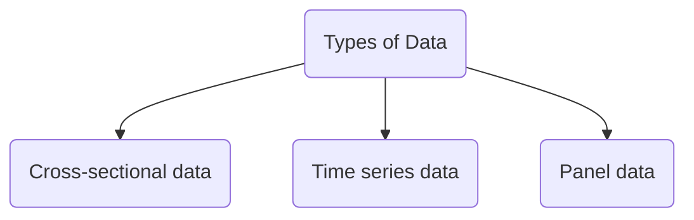

---
aliases:
  - Panel Data
  - Fixed Effects
  - Longitudinal Data
tags:
  - statistics
  - causal-inference
---
> [!ABSTRACT] 🧠 Recall
> **In one line:** Regression on **many units observed over many time periods** — which lets you control for everything stable about each unit, even things you never measured.
> **Metaphor:** 100 coffee shops, 100 days each. Compare each shop *to itself over time*, so its location and owner stop mattering.
> **Where it bites:** Fixed effects are the workhorse of applied causal inference. The gotcha is [[Auto-regressive lags#^nickell-bias|Nickell bias]].

---
It's a [[Regression Analysis|regression technique]] that combines 2 key ideas:
- Panel Data
- OLS

## Panel Data
Also called **Longitudinal data** - tracks a single subject over a period of time

```mermaid
graph TD;
A(Types of Data) --> B(Cross-sectional data)
A --> C(Time series data)
A --> D(Panel data)
```

> [!NOTE] Types of data
> 
 >   - **Cross-Sectional Data**: The sales of 100 different coffee shops on one specific day.
 >   - **Time-Series Data**: The sales of _one single_ coffee shop over 100 days.
 >  - **Panel Data**: The sales of _100 different_ coffee shops over _100 days_.
 
---

## OLS
Stands for **Ordinary Least Squares**

So we know we need to do regression analysis but how is it done?
OLS is 1 such method to do regression.
Regression says we need to find the values for $\beta_0$ and $\beta_1$, to draw the **best fit line** which minimizes the residual (error). And OLS says residual is simply the **sum of squared errors**

$$\min_{\beta_0,\beta_1} \sum_i (y_i - \beta_0 - \beta_1 x_i)^2$$

The residual for each point is $y_i - \hat{y}_i$; OLS squares them and minimises the total. Squaring makes it smooth and solvable in closed form, at the cost of sensitivity to outliers — see [[Regression Analysis#How the line is actually found|how the line is found]].

---
# Why panel data is worth the trouble

This is the payoff, and it's a big one.

Say you're estimating whether a loyalty scheme raised coffee sales. Sales also depend on the shop's location, footfall, the owner's competence, local competition — none of which you measured, and all of which probably correlate with which shops adopted the scheme. Classic **omitted variable bias**, and with cross-sectional data you're stuck.

But with panel data you observe **the same shop repeatedly**. So compare each shop *to itself*:

> [!SUCCESS] The fixed-effects trick
> Give every unit its own intercept $\alpha_i$:
> $$Y_{it} = \alpha_i + \beta D_{it} + \varepsilon_{it}$$
>
> That $\alpha_i$ absorbs **everything about unit $i$ that doesn't change over time** — measured or not, known or unknown. Location, management, brand. You never have to observe them; they're differenced out. 🎯
>
> $\beta$ is then identified purely from **within-unit variation over time**. ^fixed-effects-trick

Mechanically it's just demeaning: subtract each unit's own average from every variable, then run OLS. Anything constant within a unit becomes zero and drops out.

> [!WARNING] What fixed effects cannot save you from
> It only removes **time-invariant** confounders. Anything that varies over time *and* correlates with treatment is still a problem — if shops adopted the loyalty scheme exactly when their neighbourhood was gentrifying, fixed effects will not help you. 🚧
>
> It also can't estimate the effect of anything that doesn't vary within a unit. Want to know the effect of a shop's *location*? Fixed effects has already deleted it.

---
# Fixed vs random effects

| | **Fixed effects** | **Random effects** |
|---|---|---|
| Treats $\alpha_i$ as | a parameter per unit | a **draw from a distribution** |
| Assumes | $\alpha_i$ may correlate with $X$ ✅ | $\alpha_i$ **uncorrelated** with $X$ ⚠️ |
| Uses | within-unit variation only | within **and** between |
| Efficiency | lower | higher — *if* its assumption holds |
| Default for causal work | ✅ **this one** | only with justification |

The random-effects assumption is strong and usually false in observational data — it's essentially "the unobserved unit characteristics are unrelated to treatment", which is the very thing you were worried about. The **Hausman test** formally compares them, but in practice most applied causal work defaults to fixed effects because the safer assumption is worth the lost efficiency.

**Two-way fixed effects** adds time fixed effects $\gamma_t$ as well, absorbing anything that hit all units in a given period (a holiday, a recession). $Y_{it} = \alpha_i + \gamma_t + \beta D_{it} + \varepsilon_{it}$ — and this is the standard **difference-in-differences** specification.

> [!WARNING] Two things that will get flagged in review
> 1. **Cluster your standard errors** by unit. Observations from the same shop are correlated across days; ignoring that gives standard errors that are far too small and p-values that are far too good. Almost always the right default in panel data.
> 2. **Staggered adoption.** If units get treated at *different times*, plain two-way fixed effects can be badly biased — already-treated units end up serving as controls with negative weights. This was a significant recent finding in econometrics; the fixes are Callaway–Sant'Anna, Sun–Abraham, and related estimators. If your treatment rolled out gradually, this applies to you. ^staggered-did

---
# ⁉️
Adding the outcome's own past as a control — and the bias that creates with fixed effects — is [[Auto-regressive lags]].
