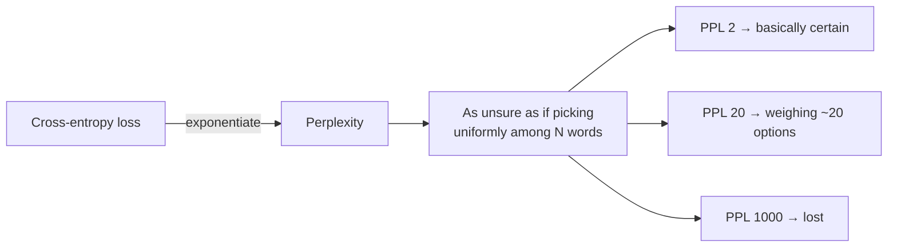

---
aliases:
  - PPL
  - Perplexity
tags:
  - llm
  - metrics
  - evaluation
---
> [!ABSTRACT] 🧠 Recall
> **In one line:** $\text{PPL} = e^{\text{cross-entropy}}$ — "on average, how many equally-likely words was the model torn between?"
> **Metaphor:** A quiz show. Perplexity 8 means the contestant had narrowed it to 8 plausible answers, every single question.
> **Where it bites:** It's the number pre-training curves are read off. It's also ~={red}not comparable across tokenizers=~, and it doesn't measure usefulness.

---
Two language models read the same sentence: `"The cat sat on the ___"`.

- **Model A** assigns `mat` a probability of 0.5.
- **Model B** assigns `mat` a probability of 0.1.

Which is better? A, obviously. But *how much* better — and how do you turn "better on this one blank" into one number over a whole corpus?

Try the obvious thing: average the probabilities. Now run it over 1,000 tokens and multiply them instead... you get $10^{-3000}$, which underflows to zero and tells you nothing.

Take logs, then. Average log-probability: a negative number, around $-2.3$. Correct, but what does $-2.3$ *feel* like? Nothing. It's not on a scale anyone has intuition for.

So — what scale *would* have intuition?

---
# The quiz show

Picture a contestant on a quiz show with a multiple-choice question.

If she's been narrowed down to **2 options**, she's guessing between two. If she's torn between **50**, she's basically lost. "How many options am I effectively choosing between?" is a number humans feel instantly.

Now: a model that assigns `mat` a probability of 0.5 is behaving exactly like someone choosing uniformly among **2** options. One that assigns 0.1 is behaving like someone choosing among **10**.

$$\frac{1}{0.5} = 2 \qquad \frac{1}{0.1} = 10$$

Do that geometrically across the whole corpus, and you have your number.

> [!NOTE] Perplexity
> The exponentiated average negative log-likelihood per token:
> $$\text{PPL} = \exp\left(-\frac{1}{N}\sum_{i=1}^{N} \log p(x_i \mid x_{<i})\right) = e^{H}$$
> where $H$ is the [[Cross Entropy]] in nats. It is the **effective branching factor**: the size of the uniform choice the model's uncertainty is equivalent to. ^perplexity-def

> [!SUCCESS] Core idea
> ~={pink}Perplexity is just cross-entropy loss, put back onto a scale you can picture.=~ Your training loss of 2.1 nats *is* a perplexity of $e^{2.1} \approx 8.2$ — "torn between about 8 words, on average." Same quantity, human units. ^ppl-is-exp-ce

Useful anchors: uniform over a 50k vocabulary → PPL 50,000. Early n-gram models → ~200. GPT-2 on WikiText → ~20. Modern frontier models → single digits. Below ~1.5 on natural text usually means ~={red}you're evaluating on data the model was trained on.=~

---
# The traps 🪤

> [!WARNING] Perplexity is not comparable across tokenizers
> It's *per token*, and tokens are defined by the [[Tokenization|tokenizer]]. A model with a bigger vocabulary spends fewer, harder-to-predict tokens on the same text and will show a **higher** PPL while being a better model. ~={red}Comparing PPL between two models with different tokenizers is meaningless.=~ Normalise per *character* (bits-per-byte) if you must compare. ^ppl-tokenizer-trap

> [!WARNING] Low perplexity ≠ useful model
> Perplexity measures one thing: how well the model predicts **the next token of text that already exists**. It cannot see whether the model follows instructions, refuses harmful requests, reasons correctly, or is honest. [[Instruction Tuning]] and [[RLHF]] both make a model dramatically more useful while typically making raw perplexity **worse**. ^ppl-not-usefulness

That second one is the important one, and it explains the shape of the whole field: perplexity is a *pre-training* metric. Once you enter the post-training world you switch to [[Evals]] — task benchmarks, human preference, LLM-as-judge.

| Metric | Measures | Use it for |
|---|---|---|
| **Perplexity** | Next-token prediction on held-out text | Pre-training runs, [[Quantization]] regression checks, domain fit |
| **Task benchmarks** | Accuracy on specific problems | Capability claims |
| **Human / judge preference** | Do people prefer the output | Post-training, product decisions |

---
# Where you'll actually use it 🔧

1. **Pre-training loss curves** — this is what "the loss went down" means. [[Scaling Laws for Neural Language Models]] are literally curves of loss vs compute/data/params.
2. **Quantization sanity check** — quantize, measure PPL on a held-out set, and if it moved a lot you broke something. (But then run real [[Evals]] anyway — see the warning in [[Quantization#^quantization-cost|what it actually costs you]].)
3. **Domain fit** — high PPL on your company's documents is a concrete signal that [[Fine-Tuning]] or [[RAG]] might help.
4. **Contamination smell test** — implausibly low PPL on a public benchmark means the benchmark leaked into training.

Related: [[Cross Entropy]] for the underlying loss, [[KL Divergence]] for the distance-between-distributions view, and [[Uncertainty]] for the broader question of what a model's confidence is worth.

---
---
#### 🖼️ What the number actually means

# ⁉️
That's the machine, end to end: tokens in, distribution out, a die roll, repeat. Everything from here is about what you **put into** the window — starting with the fact that how you phrase the request changes the answer more than most model upgrades do.

→ [[Prompt Engineering]]
