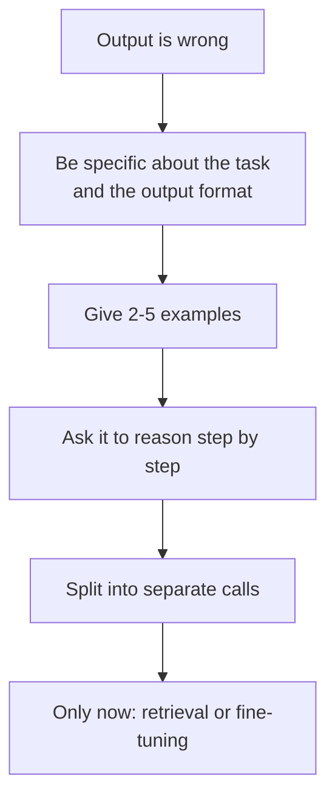

---
aliases:
  - Prompting
  - Prompt Design
  - Prompt
tags:
  - llm
  - prompting
---
> [!ABSTRACT] 🧠 Recall
> **In one line:** You're not "asking nicely" — you're **conditioning a distribution**, picking the region of the model's behaviour space you want to sample from.
> **Metaphor:** Briefing a brilliant contractor who has amnesia, no access to your systems, and will never ask a clarifying question.
> **Where it bites:** It's the cheapest lever by an order of magnitude, and the first thing to exhaust before anyone says "fine-tune."

---
Same model, same [[Sampling Parameters|temperature]], same task. Two prompts:

**Prompt A:** `Is this review positive or negative? "Took forever but worth it."`
→ *"This review appears to be mixed, leaning positive. The phrase 'took forever' suggests..."*

**Prompt B:**
```
Classify the sentiment. Respond with exactly one word: POSITIVE, NEGATIVE, or MIXED.

Review: "Took forever but worth it."
Sentiment:
```
→ `MIXED`

Prompt A's output broke your downstream parser. Prompt B's didn't.

Now — the model didn't get smarter between A and B. Nothing about its weights changed. So what *did* change?

---
# The amnesiac contractor

You've hired a genuinely brilliant contractor. World-class. But:

- She has **total amnesia** — every morning she arrives knowing nothing about your project ([[Context Window|the whiteboard]] is all she has)
- She has **no access** to your systems, your data, your Slack
- She has read essentially everything ever written, so she knows *every* convention, which means she doesn't know **which one you want**
- And critically: ~={red}she will never ask you a clarifying question.=~ She'll pick the most statistically common interpretation and confidently proceed

Given that person, what does a good brief look like? It's not politeness. It's: **who you are in this context, what the output must look like, what to do at the edges, and an example.**

> [!SUCCESS] Core idea
> A prompt doesn't *instruct* the model so much as **locate** it. The weights already contain a distribution over "how a text like this continues." Your prompt is the conditioning that selects ~={pink}which slice of that distribution you're sampling from=~ — brilliant-analyst slice or unhelpful-forum-reply slice. Everything below is a technique for aiming that selection. ^prompt-as-conditioning

---
# The levers that actually move the needle 🎚️

**1. Role and task, not vibes.** `You are a senior tax accountant reviewing a UK self-assessment` conditions on a whole body of vocabulary, conventions and caution. `You are a helpful assistant` conditions on nothing — it's the default already.

**2. Show, don't tell.** One worked example beats three paragraphs describing the format. This is [[In Context Learning|few-shot prompting]], and it's the single highest-leverage move. Crucially: your examples must cover the *edge cases you care about*, because the model will imitate their **shape** far more faithfully than your prose.

**3. Structure the prompt.** Delimit sections (XML tags, markdown headers) so instructions can't be confused with data. This isn't cosmetic — it's the same boundary that stops [[Prompt Injection]].

**4. Put the instruction where it will be read.** With long inputs, instructions at the very start *and* repeated at the end survive [[Lost in the Middle]]; a single instruction buried in the middle of a 50k-token paste often doesn't.

**5. Give it room to think.** Asking for the answer first and the reasoning after is asking it to commit before computing. Reverse it → [[Chain of Thought]].

**6. Tell it what to do when it can't.** `If the context doesn't contain the answer, reply exactly: NOT_FOUND.` Without an escape hatch, the most probable continuation of a question is *an answer* — which is a direct route to [[Hallucination]].

**7. Prefill the output.** Ending your prompt with `Sentiment:` or `{` commits the continuation to your format before sampling begins. Cheap and very effective — see [[Structured Output]].

| Anti-pattern | Why it fails | Do instead |
|---|---|---|
| "Don't be verbose" | Negations condition on the very thing you named | "Answer in at most 2 sentences" |
| "Be accurate" | Unfalsifiable; changes nothing | Give the source and forbid outside knowledge |
| One mega-prompt for 5 tasks | Instructions compete and the tail gets dropped | Chain separate calls |
| Examples that are all the easy case | It learns the easy shape only | Include the ugly edge cases |
| Tuning the wording forever | You're overfitting to one input | Build [[Evals]] first, then tune |

---
# The discipline part 🧪

> [!WARNING] Prompting without evals is superstition
> You change a word, the one example you're staring at improves, you ship. You have **no idea** what it did to the other 200 cases — and prompt changes are famously non-monotone. ~={red}A prompt without a test set is folklore, not engineering.=~ Build 20–50 labelled cases *first*; it takes an afternoon and changes everything. See [[Evals]]. ^prompting-needs-evals

> [!TIP] The escalation ladder — stop at the first rung that works
> 1. **Better prompt** (minutes, free)
> 2. **Few-shot examples** ([[In Context Learning]] — hours, free)
> 3. **Give it the facts** ([[RAG]] — days)
> 4. **Give it hands** ([[Tool Use]] — days)
> 5. **Let it think longer** ([[Test-Time Compute]] — a config change and more tokens)
> 6. **Change the weights** ([[Fine-Tuning]] / [[LoRA]] — weeks, and now you own a model)
>
> People skip to 6 constantly. Rung 6 fixes *form, style and latency*; it very rarely fixes *knowledge*, which is what they usually wanted. 🪜

---
---
#### 🖼️ The order to try things in


Almost everyone skips to the bottom of this list. The top three are free and usually enough.

# ⁉️
Most of that brief — the role, the rules, the format, the escape hatch — doesn't change per request. It belongs in a privileged slot at the top of the window, and that slot behaves differently from the rest.

→ [[System Prompt]]
