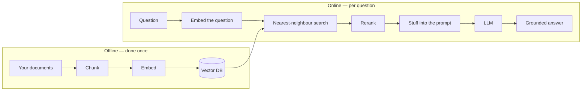

---
aliases:
  - Retrieval Augmented Generation
  - Retrieval-Augmented Generation
  - Retrieval Augmentation
tags:
  - llm
  - retrieval
  - architecture
---
> [!ABSTRACT] 🧠 Recall
> **In one line:** Don't ask the model what it knows — **fetch the relevant documents and paste them into the prompt**, then ask it to answer from those.
> **Metaphor:** An open-book exam. Same student; the difference is they're allowed to look things up, and must cite the page.
> **Where it bites:** It's a **retrieval** problem wearing an LLM costume. Nearly every bad RAG system is bad at the retrieval half.

---
Your company has 40,000 internal documents. You want a bot that answers questions about them.

Option A: [[Fine-Tuning|fine-tune]] the model on all 40,000. Weeks of work, thousands of pounds, and then someone updates the expenses policy on Tuesday and your model is confidently wrong until the next training run. You also can't tell it to *forget* the document that legal just pulled.

Option B: ask the model directly. It's never seen your intranet, so it produces something plausible-shaped and wrong — see [[Hallucination]].

Now look at what the model *is* undeniably good at: given a passage of text in its [[Context Window]], it reads it and answers questions about it with high accuracy. That capability is not in dispute at all.

So the problem isn't answering. It's ~={blue}getting the right 3 pages out of 40,000 into the window before you ask.=~

---
# The open-book exam

Closed-book, a student answers from memory: fluent on what they revised, and quietly confabulating on the rest — with **no way for you to tell which is which**.

Open-book, they answer from the page in front of them, and they cite it. Two things improve at once: the answer is right more often, **and you can check it**.

But notice where the difficulty moved. In an open-book exam, the student's problem is no longer *knowing* — it's **finding the right page in time**. Hand them the wrong chapter and the open book makes them *more* confidently wrong, not less.

> [!SUCCESS] Core idea
> ~={pink}RAG separates *knowledge* (an external, editable store) from *reasoning over knowledge* (the model).=~ Update a fact by editing a row, not by retraining. Revoke a document by deleting it. And because the answer points at sources, it's **auditable** — which is usually the real reason a regulated business can ship it at all. ^rag-separates-knowledge

> [!NOTE] RAG
> **Retrieval-Augmented Generation.** At query time: retrieve relevant chunks from an external corpus, insert them into the prompt as context, and instruct the model to answer *from that context*. The weights are untouched. ^rag-def

---
# The pipeline, and where each stage fails 🔧

**Offline (indexing):**
1. **Parse** — PDFs, tables, slides → text. *Fails: tables destroyed, headers lost, OCR noise.* The most under-rated stage by a mile.
2. **Chunk** — split into passages. *Fails: the answer straddles a boundary.* Overlap, and prefer semantic/structural splits over a blind 512 tokens.
3. **Embed** — each chunk → a vector ([[Embeddings]]).
4. **Index** — store in a [[Vector Database]].

**Online (querying):**
5. **Query processing** — rewrite the question. *Fails: "what about theirs?" is meaningless without the conversation resolved into it.* ~={red}Multi-turn RAG without query rewriting is broken by construction.=~
6. **Retrieve** — top-$k$ by similarity, ideally **hybrid** (vectors **+** BM25 keyword). *Fails: pure vector search misses exact identifiers — part numbers, error codes, names.*
7. **[[Reranking|Rerank]]** — a cross-encoder reorders the top 50 down to the best 5.
8. **Assemble** — order them deliberately ([[Lost in the Middle]]), label each with its source.
9. **Generate** — with an explicit instruction to use only the context and to say so when it can't ([[Grounding]]).

| Symptom | Where to look first |
|---|---|
| "I don't know" but the doc exists | Retrieval (embeddings, chunking, hybrid search) |
| Right doc retrieved, wrong answer | Prompt, context ordering, model |
| Cites a real doc that doesn't say that | Grounding instruction; add citation checking |
| Great on simple Qs, fails on comparisons | Needs multi-query / [[Agentic Workflows\|agentic]] retrieval |
| Exact IDs never found | ~={red}Pure vector search — add BM25=~ |

> [!TIP] Evaluate the halves separately
> The single highest-value debugging habit. Measure **retrieval** (is the gold chunk in the top-$k$? → recall@k, MRR, [[NDCG]]) *independently* from **generation** (given the right chunk, is the answer right and faithful?). Teams that only look at end-to-end answer quality spend weeks tuning prompts when recall@10 was 40% all along. 🎯

---
# What RAG is and isn't

> [!WARNING] RAG ≠ no hallucination
> It *reduces* fabrication and makes it *detectable*. It does not prevent it. The model can still blend retrieved text with parametric memory, over-summarise, or answer confidently from a chunk that's merely topically similar. You still need [[Grounding]] discipline, citation checks and [[Evals]]. ^rag-not-a-cure

**RAG vs [[Fine-Tuning]]** is the question you'll be asked in every design review, so have the crisp version ready:

| | RAG | Fine-tuning |
|---|---|---|
| Teaches | **Facts** | **Form, style, task behaviour** |
| Update speed | Instant (edit a row) | New training run |
| Attribution | Yes, cites sources ✅ | None |
| Per-request cost | Higher (long prompts) | Lower |
| Answer to "should we?" | Usually **start here** | When RAG's *form* is wrong, not its facts |

They compose: fine-tune for the house style, retrieve for the facts.

---
---
#### 🖼️ The two halves — nothing here is training

# ⁉️
Every stage above rests on one primitive — turning a chunk of text into a vector where "nearby" means "means the same thing." That primitive deserves its own note.

→ [[Embeddings]]
