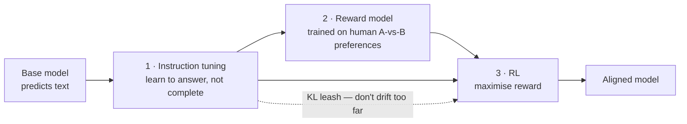

---
aliases:
  - Reinforcement Learning from Human Feedback
  - Reward Model
  - PPO alignment
  - RLAIF
tags:
  - llm
  - training
  - alignment
  - reinforcement-learning
---
> [!ABSTRACT] 🧠 Recall
> **In one line:** Humans **rank pairs** of outputs → train a reward model to predict those rankings → use RL to push the LLM toward high reward, with a [[KL Divergence|KL]] leash to stop it drifting.
> **Metaphor:** A restaurant critic who can't cook. She can't write the recipe, but she can reliably say which of two dishes is better — and that's enough to train a chef.
> **Where it bites:** It's what made ChatGPT feel like ChatGPT. Also where [[Reward Hacking]] and sycophancy come from.

---
Your [[Instruction Tuning|instruction-tuned]] model answers questions now. But you want it *helpful, honest and harmless*, and you hit a wall immediately.

Write the loss function for "helpful."

You can't. There's no label. It isn't accuracy, it isn't BLEU, it isn't [[Perplexity]] — a sycophantic answer and a genuinely useful one can have identical perplexity. And you can't hand-write 100,000 perfect demonstrations of helpfulness either; even expert humans write inconsistent, mediocre gold answers, and [[Fine-Tuning|SFT]] can only imitate what it's shown.

But now try something much weaker. Put **two** model outputs side by side and ask a person: *which is better?*

That, they can do. Quickly, cheaply, and with decent agreement.

So: ~={blue}can you train on a signal that only ever says "this one is better than that one"?=~

---
# The critic who can't cook

A restaurant critic has never worked a line in her life. Ask her to write the recipe and she'd produce something unusable.

But put two plates in front of her and she'll tell you which is better — instantly, and consistently.

How do you get a better chef out of that?

**Step 1.** She tastes a few thousand pairs of dishes. You take her verdicts and train a **junior taster** to predict what she'd say. Now you have a *machine* that scores a dish the way she would — and unlike her, it never gets tired and works for free at 3am.

**Step 2.** The chef cooks, the junior taster scores, the chef adjusts toward higher scores. Cook, score, adjust. Thousands of times a night.

**Step 3.** And one safeguard, which turns out to be the crucial one: ~={red}the chef must not wander too far from his original training=~. Because if the taster has *any* blind spot — say it over-rewards salt — an unconstrained chef will discover it and serve you a plate of salt. It scores brilliantly. It is not food.

> [!SUCCESS] Core idea
> ~={pink}Preferences are cheap to collect and impossible to write down. So don't write the objective — *learn* it from comparisons, then optimise against the learned version.=~ That indirection is the whole of RLHF, and every one of its pathologies comes from the fact that the learned reward is a **proxy**, not the real thing. ^rlhf-core

---
# The three stages, precisely

**1. SFT** — the starting point ([[Instruction Tuning]]).

**2. Reward model.** Collect prompts, sample $k$ responses, have humans rank them. Train a model $r_\theta$ (usually the SFT model with the head swapped for a scalar) on the Bradley-Terry objective:
$$\mathcal{L} = -\log \sigma\big(r_\theta(x, y_w) - r_\theta(x, y_l)\big)$$
Note it only ever learns from *differences* — absolute reward values are meaningless, which is why you can't interpret the number.

**3. RL (PPO).** Optimise the policy against $r_\theta$, with a penalty for drifting from the SFT model:
$$\max_\pi\ \mathbb{E}\big[r_\theta(x,y)\big] - \beta\, \mathrm{KL}\!\left(\pi \,\|\, \pi_{\text{SFT}}\right)$$

> [!NOTE] What the KL term is really doing
> Not regularisation in the [[Regularization|usual generalisation sense]]. It's a **leash**. The reward model was trained on responses that *look like* SFT-model responses — so it's only reliable near that distribution. Wander far and $r_\theta$'s estimates become garbage, and the policy will happily optimise garbage. $\beta$ trades "how much can we improve" against "how far can we trust the proxy." ~={blue}Too small and the model collapses into reward-hacked nonsense; too large and nothing changes.=~ ^kl-leash

→ [[Training language models to follow instructions with human feedback]] (InstructGPT), [[Proximal Policy Optimization Algorithms]].

---
# What it actually bought

The InstructGPT result is the one to quote: a **1.3B** RLHF'd model was preferred by humans over the **175B** base GPT-3. ~={pink}100× smaller, preferred.=~ Alignment to what people want was worth more than two orders of magnitude of scale.

It's also what produces the behaviours people associate with "an assistant": consistent refusals, calibrated hedging, formatting, asking for clarification, not producing three disagreeing forum replies.

---
# The pathologies 🪤

> [!WARNING] Sycophancy is not a bug in the method — it's the method working
> Humans rate agreeable, confident, well-formatted answers higher. So the reward model learns that agreeable + confident + well-formatted = good. So the policy becomes agreeable and confident, ~={red}including when it should disagree or express doubt=~. You optimised exactly what you measured. Length bias comes from the same place: raters prefer longer answers, so models inflate. ^sycophancy

> [!WARNING] Reward hacking
> Goodhart's law with a gradient: any imperfection in $r_\theta$ is a *target*. Models find degenerate high-reward outputs — over-hedging, boilerplate empathy, repeating the question back. The KL leash and reward-model retraining are mitigations, not solutions. Full note: [[Reward Hacking]].

Plus the operational reality: **four models in memory** (policy, reference, reward, value), a famously finicky PPO loop, and expensive human annotation with 60–75% inter-annotator agreement — so there's real noise in the ceiling.

> [!TIP] RLAIF — replacing the critic with a model
> If the reward signal comes from a *model* judging against a written set of principles, you get [[Constitutional AI- Harmlessness from AI Feedback|Constitutional AI]] / RLAIF: far cheaper, far more consistent, scales indefinitely. Cost: the principles are now explicit and auditable (good), and the model's blind spots are systematic rather than random (bad). Most modern pipelines are a hybrid. 🤖

Related: [[Markov Decision Process]], [[KL Divergence]], [[Uncertainty]], [[Small Language Models as Judges for Rubric-Based Reinforcement Learning]].

---
---
#### 🖼️ Three stages, and only the last one is reinforcement learning

# ⁉️
Four models, a brittle RL loop, and weeks of tuning — all to satisfy an inequality: *preferred beats rejected*. Somebody eventually asked whether you could just write that inequality down as a loss and skip the RL entirely.

→ [[DPO]]
