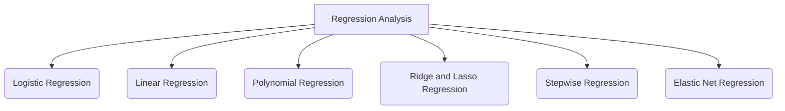

It's a stats tool used to understand and model relationships between variables.
Typically the relationship between a **dependent** variable (thing you're trying to predict) with **independent** variables (things you know and the factors that you think influence the target / dependent variables)

## Building blocks
### Dependent Variable (DV)
- Also called **Endogenous** variables
	- _"Endo-"_ means "internal," because its variation is explained _internally_ by the model.
- The **outcome** or the **effect**. It's the main thing you're interested in predicting or explaining.
### Independent Variable (IV)
- Also called **Exogenous** variables
	- _"Exo-"_ means "external," because its value is determined _externally_, outside of the model.
- The **inputs** or the **causes**. They are the factors you think influence the dependent variable.

## How regression works?
### Example: Growing a plant
Imagine we're growing a plant. 🌱

The **height of the plant** would be the **dependent variable** because it _depends_ on other factors. The amount of **sunlight** and **water** it gets would be the **independent variables**, since we can change them to see how they affect the plant's height.

### Example: Sales prediction
A coffee shop :coffee: owner wants to predict his daily sales using the temperature outside.
Here, the **daily sales** is the dependent variable; and the **temperature** is the independent variable

Let's say we gathered some data for some days:

| Temperature (°C) | Coffee Sales ($) |
| ---------------- | ---------------- |
| 20               | 250              |
| 22               | 280              |
| 25               | 320              |
| 28               | 370              |
| 30               | 410              |

Now, typically, what as an analyst you'd do is, plot the points in a graph - like a scatter plot to see if there is a visual pattern there!
You could also go a step further and _draw a straight line that **best fits** through the middle of all the points_. This is typically called the ~={blue}line of best fit =~

It serves 2 main purposes:
1. **Prediction:** The line gives us a model to predict sales for a temperature we ~={red}haven't seen before=~. For example, we could look at the line to estimate sales for a 26°C day.
2. **Quantifying Error:** The distance from each actual data point to the line shows us how wrong our model's prediction was for that day. In statistics, this error is called a **residual**.

---

How does the line of best fit actually work? It's defined by a simple mathematical equation. For a straight line, the equation is:
$Y=\beta_0 + \beta_1 ​X$
In our coffee shop example, 
- $Y$: The **Dependent Variable** (e.g., Coffee Sales ☕).
- $X$: The **Independent Variable** (e.g., Temperature 🌡️).
- $\beta_0$​: The **Intercept**. It's the predicted value of $Y$ when $X$ is zero.
	In our example, it's the baseline sales we might expect on a 0°C day.
- $\beta_1$​: The **Coefficient** or **Slope**. This is your "(linear) scaling factor." It tells us how much we expect $Y$ to change for a one-unit increase in $X$.

For instance, if our regression analysis resulted in the equation: 
$Sales = 50 + 12 * Temperature$

This would mean:
- The baseline sales ($\beta_0$​) are **$50**.
- For every 1-degree increase in temperature, sales are predicted to increase by **$12** ( $\beta_1$).

---

## Types of regression analysis

### Linear Regression
outcome (DV) is a continuous value

### Logistic Regression
outcome (DV) is categorical

> [!NOTE] Other types of regression
>
> **Polynomial Regression**
This type of regression is used when the relationship between the independent variable ($X$) and the dependent variable ($Y$) is not a straight line, but a curve. It models this by adding polynomial terms (like $X^2$, $X^3$, etc.) to the equation.
>
> * **When to use it**: Think of the relationship between a car's speed and its fuel efficiency. As you increase speed, efficiency goes up, but only to a point. After a certain speed, efficiency starts to decrease. This creates a curve, not a straight line.
>
>
> **Ridge and Lasso Regression**
These are advanced types of linear regression that are used to prevent a problem called **overfitting**. Overfitting happens when a model learns the training data *too* well, including its noise and random fluctuations, and then performs poorly on new, unseen data. Both Ridge and Lasso add a penalty for having too many or too complex variables.
>
> * **Ridge Regression**: This method is particularly useful when you have independent variables that are highly correlated with each other (a problem known as **multicollinearity**). For example, if you're predicting a house price using both its square footage and the number of bedrooms, these two variables are likely to be very similar, and Ridge can handle that.
> * **Lasso Regression**: Lasso is useful when you have a large number of independent variables and you suspect that only a few of them are actually important. Lasso can shrink the coefficients of unimportant variables all the way to zero, effectively removing them from the model.
>
>
>
> **Stepwise Regression**
This isn't a different type of model so much as an automated way to build one. It's an algorithm that iteratively adds and removes independent variables to find the set that best explains the dependent variable.
>
> * **Forward selection** starts with no variables and adds them one by one.
> * **Backward elimination** starts with all variables and removes them one by one.
> 
> * **When to use it**: Imagine you're a medical researcher with data on 100 different lifestyle factors (diet, exercise, habits, etc.) and you want to find the top 5 factors that best predict a patient's risk of heart disease. Stepwise regression can automate the search for that best combination.
>
> **Elastic Net Regression**
This is a hybrid of Ridge and Lasso regression. It combines the penalties from both methods, which allows it to handle situations where you have high multicollinearity *and* you want to perform variable selection.
>
> * **When to use it**: It's a go-to when you're not sure whether Ridge or Lasso would be better. It gives you the best of both worlds, offering a balance between handling correlated predictors and simplifying the model.

---
