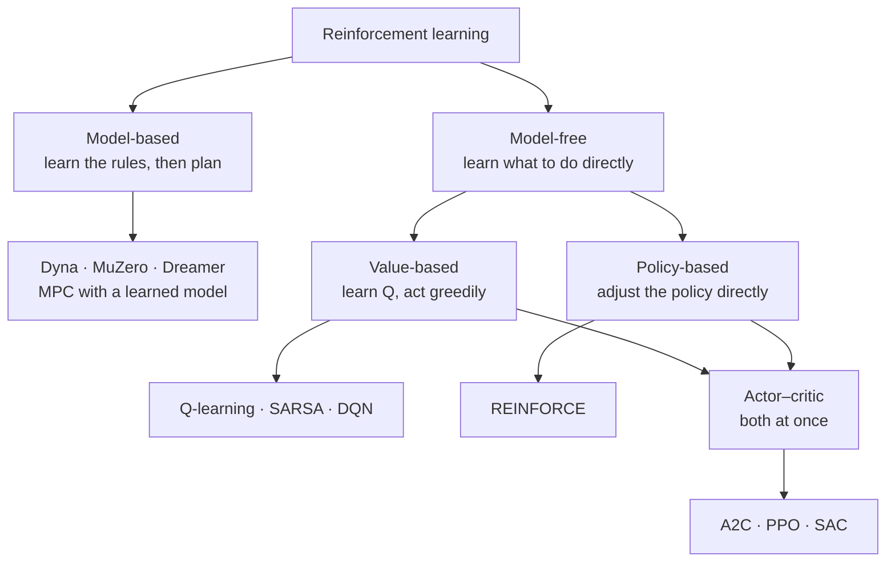

---
aliases:
  - RL
  - Reinforcement Learning (RL)
  - Agent-Environment Loop
  - Trial and Error Learning
  - Episode
  - Trajectory
  - Rollout
tags:
  - reinforcement-learning
  - decision-sciences
  - fundamentals
---
> [!ABSTRACT] 🧠 Recall
> **In one line:** Learning **what to do** by trying things and seeing what happens — with no labels, only a score; with consequences that arrive late; and with data that depends on your own choices.
> **Metaphor:** Learning to ride a bike. Nobody hands you the equations or the "correct" handlebar angle. You wobble, you fall, you adjust.
> **Where it bites:** Games, robotics, recommender slates, ad bidding, chip layout — and the final training stage of every modern LLM. Also: knowing when **not** to use it.

---
Think about how you learned to ride a bike.

Nobody gave you the physics. Nobody could give you a dataset of *(situation → correct handlebar angle)*, because nobody knows it in those terms — not even people who can ride.

What you had was: try something, and the world answers. Stayed upright for three more metres? *Good, more of that.* Gravel in your knee? *Less of that.* And the feedback was often late — the mistake that put you on the ground happened a second *before* you fell.

~={blue}How is that different from the way a classifier learns?=~

---
# The bike 🚲

Three ways, and each one is a genuine difficulty:

| | **Supervised learning** | **Reinforcement learning** |
|---|---|---|
| Feedback says | "the right answer was **cat**" — *instructive* | "that was worth **+3**" — *evaluative*. It never says what would have been better |
| Feedback arrives | immediately, per example | **late** — [[Credit Assignment\|which earlier action earned it?]] |
| The data | fixed, independent of the model | **generated by your own behaviour** — a bad policy collects bad data |

That third row is the deep one. A classifier that's wrong doesn't change its training set. An agent that never tries the left-hand path *never finds out* what's down there → [[Exploration vs Exploitation]].

![[rl_agent_environment_loop.png]]

> [!NOTE] Reinforcement learning
> Learning a [[Policy|policy]] that maximises cumulative [[Reward Function|reward]] through interaction with an environment, **without being given the environment's rules**. ^rl-def

> [!SUCCESS] Core idea
> ~={pink}An [[Markov Decision Process|MDP]] is the *problem*. RL is how you solve it when nobody hands you $P$ and $R$.=~ [[Dynamic Programming]] computes the answer from the rulebook; RL has to discover the rulebook's consequences by living in it. It's less a new goal than [[Decision Sciences#5. Reality intrudes again: the model is unknown|a concession to ignorance]]. ^rl-is-mdp-without-the-model

---
# The vocabulary, in one place

| Term | Meaning | On the bike |
|---|---|---|
| **Agent** | the learner and decision-maker | you |
| **Environment** | everything else | bike, road, gravity |
| **State / observation** | what the agent gets to see → [[State-Space Model]] | lean angle, speed |
| **Action** | what it can do | steer, pedal, brake |
| **[[Reward Function\|Reward]]** | one number per step | +1 per metre upright, −100 for falling |
| **Episode** | one run from start to termination | one attempt, push-off to crash |
| **Trajectory / rollout** | the recorded sequence $s_0, a_0, r_0, s_1, \ldots$ | the video of that attempt |
| **[[Discount Factor\|Return]]** | the (discounted) sum of rewards — *the thing being maximised* | how far you got |
| **[[Policy]]** | situation → action | your riding reflexes |
| **[[Value Function]]** | predicted return from here | "this wobble is recoverable" |
| **Model** | a predictor of the environment's response | your intuition for what steering does |

> [!WARNING] "Model" means something specific here
> In RL, *model* means **a model of the environment** — something that predicts the next state and reward. A "model-free" agent may well contain an enormous neural network. → [[Model-Based vs Model-Free RL]] ^model-means-environment-model

---
# The map of methods 🗺️

Three questions sort any algorithm you'll meet:

| Question | Options | Note |
|---|---|---|
| Does it learn the world's rules? | model-based / model-free | [[Model-Based vs Model-Free RL]] |
| What does it learn? | values · a policy · both | [[Q-Learning]] · [[Policy Gradient]] · [[Actor-Critic]] |
| Whose experience can it use? | only its own current policy's / anyone's | [[On-Policy vs Off-Policy]] |

---
# When **not** to use it 🪜

> [!TIP] Climb only as far as you need
> 1. **You have the right answers?** → supervised learning. Far more data-efficient.
> 2. **Your action doesn't change what you'll face next?** → it's a [[Multi-Armed Bandit|bandit]], or a [[Contextual Bandit|contextual bandit]]. No credit assignment needed.
> 3. **You know the rules?** → *plan* — [[Dynamic Programming]], [[Model Predictive Control]], [[Monte Carlo Tree Search]].
> 4. **You only have logs and can't experiment?** → [[Off-Policy Evaluation]], [[Offline RL]].
> 5. **None of the above** — actions have delayed consequences, no model, and you can interact → **full RL**.
>
> RL is the most general tool in this list and therefore the most expensive, the most fragile and the hardest to debug. ~={blue}Most problems pitched as RL are rung 1 or 2.=~ ^rl-escalation-ladder

> [!WARNING] "The reward is just a label"
> A label tells you the answer. A reward tells you how good *your* answer was, and says nothing about the alternatives you didn't try. That's why RL must explore, why it's so sample-hungry, and why a supervised-learning intuition ("just get more data") quietly misleads you: **the agent chooses its own data.**

---
> [!SUCCESS] If you remember one thing
> No labels, late feedback, and you generate your own data. ~={pink}Everything difficult about RL is one of those three — and if your problem doesn't have all three, there's probably a simpler tool.=~

---
# ⁉️
The first fork in that map: faced with a world whose rules you don't know, do you try to **learn the rules** and plan with them — or skip the rules and learn **what to do** directly?

→ [[Model-Based vs Model-Free RL]]
