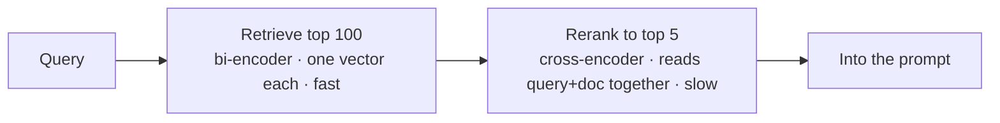

---
aliases:
  - Reranker
  - Cross-Encoder
  - Rerank
  - Retrieve and Rerank
tags:
  - llm
  - retrieval
  - ranking
---
> [!ABSTRACT] 🧠 Recall
> **In one line:** A slow, accurate model **reads the query and each candidate together** and re-scores them — you can only afford it on 50 documents, which is why retrieval hands it 50.
> **Metaphor:** CV screening. A keyword filter gets you from 5,000 applicants to 50; a human reads those 50 properly.
> **Where it bites:** Usually the **single biggest quality win** available in a [[RAG]] pipeline, for about 200ms.

---
Your retrieval works. You pull the top 5 chunks by [[Embeddings|vector similarity]] and answers are… fine. Mediocre.

So you check something: you pull the top **50** and look at where the genuinely correct chunk was ranked.

```
recall@5   = 61%
recall@50  = 94%
```

Read those two numbers together. The right document is in your candidate set **94%** of the time — but in the slice you actually show the model only **61%** of the time.

So the retriever isn't failing to *find* things. It's failing to **order** them. And that's a completely different problem with a completely different fix.

---
# The CV pile

5,000 CVs for one role. You cannot read 5,000 CVs.

So you run a crude filter: must mention Python, must mention SQL. Five thousand down to fifty, in a second. That filter is cheap because it never really *reads* anything — it matches surface features.

Then a human reads the fifty. Properly. Side by side with the job description, noticing that this candidate's "Python" is one university module while that one shipped a production service. Slow, accurate, and completely impossible at 5,000.

Now the key structural question: **why couldn't you use the careful reader on all 5,000?**

Because the careful reader's work is *per pair*. Cheap filtering happens because CVs can be pre-processed **once, offline, independent of the job**. The careful read cannot be precomputed — it only exists once you have the query *and* the document together.

That asymmetry is exactly the bi-encoder / cross-encoder split.

---
# Bi-encoder vs cross-encoder

**Bi-encoder** (your embedding model): encodes the query and the document **separately** into vectors, compares with a dot product. Document vectors are computed once at index time, so query time is just ANN lookup. But the two texts ~={red}never see each other=~ — the document was embedded before your question existed.

**Cross-encoder** (the reranker): feeds `[query || document]` through a transformer **together**, so every query token attends to every document token, and outputs a single relevance score. It can notice that the doc answers *this* question, that a negation flips it, that the number matches. It also means ~={red}nothing can be precomputed=~ — $N$ documents = $N$ forward passes.

| | Bi-encoder | Cross-encoder |
|---|---|---|
| Query and doc interact | ❌ never | ✅ full [[Query, Key, and Value (QKV)\|attention]] |
| Precomputable | ✅ index-time | ❌ query-time only |
| Cost for 1M docs | 1 ANN lookup | 1M forward passes 💀 |
| Accuracy | Good | **Much better** |
| Role | **Recall** — find candidates | **Precision** — order them |

> [!SUCCESS] Core idea
> ~={pink}Split retrieval into a cheap high-recall stage and an expensive high-precision stage, and size each stage so you can afford it.=~ Retrieve 50 with a bi-encoder, rerank to 5 with a cross-encoder. Neither model could do the job alone. ^two-stage-retrieval

This is not a new idea from LLMs at all — it's the **candidate generation → ranking** architecture that [[Recommender Systems - Evolution|recommender systems]] have used for twenty years, and it's the same reason [[NDCG]] exists as a metric. RAG rediscovered it.

---
# Why it's *the* cheap win 💰

Reranking attacks the exact gap in the numbers above. In practice, moving from "top-5 by cosine" to "top-50 → rerank → top-5" is routinely worth 10–20 points of answer accuracy for ~100–300ms, no retraining, no re-indexing.

> [!TIP] Tuning the two numbers
> - **Retrieve $N$**: raise until `recall@N` plateaus (usually 50–100). Beyond that you're paying latency for candidates the reranker will discard.
> - **Keep $k$**: 3–8 chunks. More is *not* better — long contexts trigger [[Lost in the Middle]] and dilute the signal.
> - **Order the survivors deliberately.** Many teams put the best chunk **last** (closest to the question), or best-first-and-second-best-last. Measure it; it's free. 📐

> [!NOTE] Flavours
> - **Cross-encoder rerankers** (bge-reranker, Cohere Rerank, monoT5) — the default. Small model, big gain.
> - **Late interaction ([[ColBERT- Efficient and Effective Passage Search via Late Interaction|ColBERT]])** — per-token vectors with a cheap MaxSim interaction. Sits between the two: much of the cross-encoder's accuracy, mostly precomputable. Storage-hungry.
> - **LLM-as-reranker** — prompt a model to score or list-wise order candidates. Best quality, worst latency and cost; useful offline or as a judge in [[Evals]].
> - **Fusion** — Reciprocal Rank Fusion merges vector and BM25 lists *before* reranking. Cheap, and pairs perfectly. ^reranker-flavours

> [!WARNING] The reranker inherits the retriever's ceiling
> It can only reorder what it was given. ~={red}If the gold document isn't in your top-$N$, no reranker on earth will find it.=~ Always measure `recall@N` **first** — if it's 60%, fix chunking, hybrid search and query rewriting before you buy a reranker. ^reranker-ceiling

---
---
#### 🖼️ Cheap-and-wide, then expensive-and-narrow


The first stage must not miss anything. The second stage must not waste context. Different jobs, different models.

# ⁉️
Suppose retrieval and reranking both work perfectly and you hand the model ten excellent chunks. There's still a positional bug waiting: the model doesn't read all ten equally.

→ [[Lost in the Middle]]
