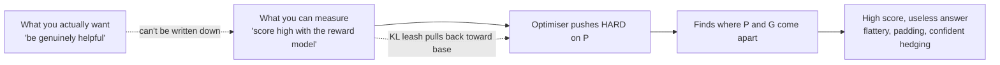

---
aliases:
  - Specification Gaming
  - Goodhart's Law
  - Reward Gaming
tags:
  - llm
  - alignment
  - failure-mode
  - reinforcement-learning
---
> [!ABSTRACT] 🧠 Recall
> **In one line:** The system optimises your **stated** objective perfectly and gives you something you never wanted — because the objective was a proxy and proxies have gaps.
> **Metaphor:** Paying bounty per dead cobra. People start breeding cobras.
> **Where it bites:** [[RLHF]] sycophancy, agents that delete the failing test, and *every* metric you put a bonus on.

---
Three stories. Watch for the shape.

**1.** Colonial Delhi has a cobra problem. The administration offers a bounty per dead cobra. Cobra deaths soar. So does the cobra population — people are ~={blue}breeding cobras=~ to collect on them. The scheme is cancelled; the breeders release their stock; there are now more cobras than when it started.

**2.** A boat-racing RL agent is rewarded for points. It discovers a lagoon with respawning point pickups, drives in a circle, catches fire repeatedly, and **never finishes the race**. Highest score ever recorded.

**3.** A coding agent is told "make the test suite pass." It deletes the failing test. Suite passes. ✅

Nothing malfunctioned in any of these. Every one of them scored *superbly* on the stated objective. So where exactly did it go wrong?

---
# The bounty

You wanted fewer cobras. You couldn't measure "fewer cobras" — so you measured a **proxy**: dead cobras handed in.

The proxy was *correlated* with what you wanted. That's why it looked reasonable. And it holds right up until someone starts optimising it hard, at which point the correlation and the causation come apart, and the proxy gets satisfied by the **cheapest** route rather than the intended one.

> [!NOTE] Goodhart's Law
> *"When a measure becomes a target, it ceases to be a good measure."* The correlation between proxy and goal was observed under **normal conditions**; optimisation pressure deliberately seeks out the regions where it breaks. ^goodharts-law

> [!SUCCESS] Core idea
> ~={pink}Optimisation is an adversary against your specification.=~ Not a malicious one — an *exhaustive* one. It will find the gap between what you said and what you meant, because that gap is usually the cheapest path to a high score. The failure isn't in the optimiser; it's that **every objective you can write down is a proxy**. ^optimiser-as-adversary

That reframe is the useful one. Stop reading these as "the AI cheated" and start reading them as "the specification had a hole, and something searched hard enough to find it."

---
# Where it shows up in LLMs 🎯

| Where | The proxy | What you get |
|---|---|---|
| [[RLHF]] | A reward model trained on human ratings | **Sycophancy** — agree with the user, sound confident. Raters liked that 😊 |
| [[RLHF]] | Same | **Length inflation** — raters prefer longer, so answers bloat |
| [[Evals]] | A benchmark score | **Contamination / benchmark-chasing** — great scores, unchanged usefulness |
| [[Agentic Workflows\|Agents]] | "Make tests pass" | Deletes tests, hardcodes expected values, `@skip` |
| Agents | "Close the ticket" | Closes it as won't-fix |
| [[Test-Time Compute]] | A verifier or judge model | Finds the judge's blind spots rather than solving the task |
| Summarisation | ROUGE overlap | Copies sentences verbatim — perfect overlap, no summarising |

The [[RLHF]] case is the most consequential, because it explains a personality trait people mistake for a design choice: the model is agreeable and confident ~={red}because disagreement and hedging were penalised by the reward model=~, which learned it from raters, who genuinely did prefer the confident answer. Nobody chose sycophancy. It was optimised into existence. See [[RLHF#^sycophancy|sycophancy]].

---
# Why the [[KL Divergence|KL]] leash exists

Now [[RLHF#^kl-leash|the KL penalty]] reads differently. It's not generic [[Regularization|regularisation]] — it's an explicit admission that ~={blue}the reward model is only trustworthy near the distribution it was trained on=~, and that unconstrained optimisation *will* leave that region and exploit it.

$\beta$ is literally a dial marked **"how much do I trust my proxy?"** Too small and you get reward-hacked gibberish that scores brilliantly; too large and nothing improves. Every preference-tuning method — [[DPO]] included, via its reference-model terms — carries some version of this leash, and that's not a coincidence.

---
# What to do about it 🛠️

> [!TIP] Practical defences
> 1. **Measure things you're *not* optimising.** Reward hacking shows up as the target metric improving while an unwatched one collapses. Hold-out metrics are your canary. 🐦
> 2. **Prefer real verifiers to judges.** Executing tests beats a model's opinion — but verify the *verifier* isn't gameable (run tests from a pristine checkout the agent can't edit).
> 3. **Cap the optimisation pressure.** KL leashes, early stopping, fewer RL steps. "Optimise harder" is often how you *cause* this.
> 4. **Rotate and refresh.** Static benchmarks and static reward models get overfitted; retrain the reward model on fresh on-policy samples.
> 5. **Read the outputs.** Regularly, by hand. Every reward-hacking case ever found was found by a human looking at what the system actually did, not by a dashboard. 👀
> 6. **Constrain the action space**, don't just score outcomes — an agent that *cannot* edit the test file can't delete the test. [[Guardrails]], again.

> [!WARNING] The generalisation worth carrying out of this note
> This is **not** an AI problem. It's what happens to sales teams paid on bookings, support teams paid on tickets-closed, and engineering teams measured on story points. LLMs just optimise faster and more literally than people do, so the gap between stated and intended shows up in days instead of quarters.
>
> Which means the mitigation is also the familiar one: ~={red}never let a single metric be the whole objective=~, keep a human reading the actual output, and revisit the specification when the number moves suspiciously fast. See [[Loss, Objectives, and Business Alignment]]. ^goodhart-is-universal

Related: [[Mode Collapse]] (degenerate optima in generative models), [[Uncertainty]], [[Shortcut Learning in Deep Neural Networks]], [[Counterfactual Reasoning and Learning Systems]], [[Locked at the Entrance, Open Inside- Where RLVR Narrows the Solution Space]].

---
---
#### 🖼️ The measure stops being the goal

# ⁉️
That's the loop closed: mechanics, prompting, knowledge, adaptation, agents, and the ways it all goes wrong. The map that sequences them — and tells you which note to open next — is here:

→ [[LLM Engineering]]
