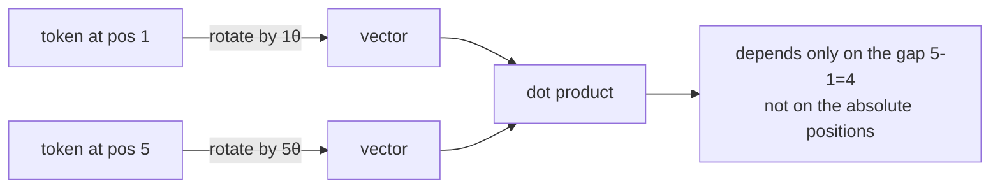

---
aliases:
  - Rotary Position Embedding
  - Rotary Embeddings
  - Positional Encoding
  - ALiBi
tags:
  - llm
  - architecture
  - attention
---
> [!ABSTRACT] 🧠 Recall
> **In one line:** Encode position by **rotating** each query and key vector by an angle proportional to its index — the dot product then depends only on the *relative* distance.
> **Metaphor:** A clock face. Two events' absolute times matter less than the angle between the hands.
> **Where it bites:** Every modern model uses it, and every [[Long Context]] extension trick (NTK, YaRN) is a manipulation of its frequencies.

---
Here's something slightly alarming about [[Query, Key, and Value (QKV)|attention]]: it is **permutation invariant**.

Attention computes $\text{softmax}(QK^T/\sqrt{d})V$ — a set of pairwise dot products. Shuffle the input tokens and you get the same set of pairs, reordered. So without help,

> *"dog bites man"* and *"man bites dog"*

are, to the attention mechanism, **the same input**. Position has to be injected deliberately.

The original transformer added a fixed sinusoidal vector to each token's embedding. It works. But notice what it does: it ~={blue}bakes *absolute* position into the token's content=~, at the very bottom of the network, and then hopes the dot products further up can recover relative distance from it.

But what does attention actually *need*? Does "the adjective modifies the noun 2 places to its right" depend on whether that's at position 5 or position 5,000?

---
# The clock face

Two colleagues tell you when they arrived: one at 9:10, one at 9:25.

You could record both absolute times. But if what you care about is *"how far apart were they?"*, there's a neater encoding: put each on a **clock face**. Nine-ten is one angle; nine-twenty-five is another. The thing you care about is the **angle between the hands** — and that angle is the same whether you started counting from midnight or from last Tuesday.

Now apply that to vectors. Take a query vector, split it into 2-dimensional pairs, and **rotate** each pair by an angle proportional to the token's position $m$. Do the same for the keys at position $n$.

What happens to the dot product? A rotation is orthogonal, so it preserves lengths and only changes relative angles — and the rotation by $m$ in the query and $n$ in the key combine to leave a dependence on exactly $(m - n)$:

$$\langle R_m q,\ R_n k \rangle = \langle q,\ R_{n-m} k \rangle$$

~={pink}Absolute positions go in; **relative** position comes out of the dot product, automatically, as a property of the geometry.=~

> [!NOTE] RoPE — Rotary Position Embedding
> Applied to $Q$ and $K$ (**not** $V$), inside every attention layer, not added to the embedding once at the bottom. Dimension pairs are rotated at **different frequencies**: $\theta_i = 10000^{-2i/d}$. Fast-rotating pairs resolve nearby positions precisely; slow-rotating pairs carry long-range position. ^rope-def

→ [[RoFormer- Enhanced Transformer with Rotary Position Embedding]]

> [!SUCCESS] Core idea
> Don't *add* position to content and hope it survives — **transform the comparison itself** so that relative distance falls out of the dot product for free. It costs no parameters, adds negligible compute, and applies at every layer. ^rope-core

The multi-frequency design is the same idea as a [[Fourier Series Decomposition|Fourier basis]], and it's also why the clock metaphor is exact: fast hands for seconds, slow hands for hours, and together they pin down a position unambiguously.

---
# Why it won 🏆

| Scheme | Mechanism | Extrapolates? | Notes |
|---|---|---|---|
| **Learned absolute** (BERT, GPT-2) | A trained vector per position | ❌ hard cap | Position 2049 has no embedding. Full stop |
| **Sinusoidal** (original transformer) | Fixed sin/cos added to embeddings | Poorly | Relative info degrades up the stack |
| **ALiBi** | Linear distance penalty on the attention score | ✅ well | Simple, strong extrapolation → [[Train Short, Test Long (ALiBi)]] |
| **RoPE** | Rotate Q and K | ⚠️ needs help | Best in-distribution quality — **the default** ✅ |

> [!WARNING] RoPE does not extrapolate for free
> The common misconception. Train on 4k and feed it 8k and quality ~={red}collapses=~ — not gracefully. The low-frequency components produce rotation angles the model has **never seen during training**, so those dot products are meaningless.
>
> This is *the* reason context extension is a whole research area, and every method in it is a frequency manipulation:
> - **Position interpolation** — squash positions 0–8k into the 0–4k range the model knows. Cheap, loses fine resolution.
> - **NTK-aware scaling** — interpolate the *low* frequencies (long range) while leaving *high* frequencies (local detail) alone. Often works with no fine-tuning at all.
> - **YaRN** — NTK plus attention-temperature correction; the current standard, needs a little fine-tuning.
> - **Raise the base $\theta$** (10,000 → 500,000+) and continue pre-training — what most long-context models actually do. ^rope-extrapolation

> [!TIP] Reading a model card
> `rope_theta: 500000` and `rope_scaling: {type: yarn, factor: 8}` are telling you exactly how the context was stretched — and how much fine-tuning went into it. A big factor with no continued training is a ~={red}red flag=~: it will pass [[Lost in the Middle#^niah-is-weak|needle tests]] and fail on real aggregation. 🔍

Related: [[Group Representational Position Encoding]], [[Causal Attention]], [[Linear Projection]].

---
---
#### 🖼️ Position as rotation

Rotate each token's vector by an angle proportional to its position. When you later take a dot product, the absolute angles cancel and only the *distance between* them survives — which is why RoPE extrapolates to lengths it never saw.

# ⁉️
So position can be stretched. The other wall doesn't move so easily: attention is still $O(n^2)$, and the [[KV Cache]] still grows linearly with every token you add.

→ [[Long Context]]

*On the [[Attention]] path: take the $O(n^2)$ wall first, and note that the fix changes the cost without changing a single output bit →* [[Flash Attention]]
