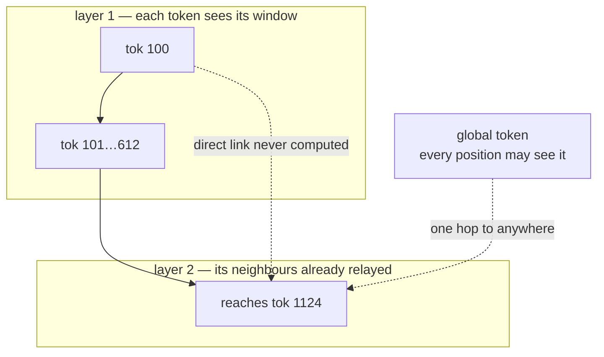

---
aliases:
  - Sparse Attention
  - Sliding Window Attention
  - Local Attention
  - Attention Sinks
  - StreamingLLM
tags:
  - llm
  - attention
  - performance
  - architecture
  - long-context
---
> [!ABSTRACT] 🧠 Recall
> **In one line:** Don't compute the whole $n \times n$ grid — give each token a **local window plus a few globally-visible tokens**, and let *depth* carry information the rest of the way.
> **Metaphor:** An open-plan office. You talk to the people around you, plus the few names everyone talks to. Word still crosses the building, one desk at a time.
> **Where it bites:** Mistral's 4k window, Longformer/BigBird, and the reason evicting the *first* few tokens of a stream destroys a model that was working fine.

---
A 32,768-token document. [[Causal Attention|Causal]] attention means every token attends to every token before it:

```
attention pairs =  n(n+1)/2  =  536,887,296     ≈ half a billion, per head, per layer
```

Half a billion dot products so that token 31,000 can consider token 4 — a word it has no plausible relationship with.

~={blue}What breaks if you simply don't compute most of them?=~

---
# The open-plan office

Four hundred people, one floor, no walls. You need a rumour to reach everyone.

The obvious design is that everybody talks to everybody — 80,000 conversations. Nobody does this. What actually happens is that you talk to the six people around your desk, and everyone talks to two or three **hubs**: the office manager, the noticeboard, the person by the coffee machine.

![[sparse_attention_open_plan_office.png]]

And the rumour still crosses the building. Not in one hop — in four or five. ~={blue}Your neighbour hears it, their neighbour hears it, and by the end of the day it has travelled the whole floor without anyone holding 400 conversations.=~

That's the entire idea. **Local connections, repeated, become global reach** — as long as there are enough hops.

> [!NOTE] Sparse attention
> Any attention pattern where the mask forbids most position pairs before the scores are computed, so the forbidden pairs are never calculated at all. The common patterns are a **sliding window** (attend to the last $w$ tokens), **global tokens** (a handful every position may see), **dilated** windows (skip stride $k$), and **block-sparse** (attend to whole blocks). ^sparse-def

In a transformer the "hops" are **layers**. A token in layer 1 sees 512 back. In layer 2 it sees tokens that themselves saw 512 back. Reach compounds:

$$\text{reach} \approx \text{layers} \times \text{window}$$

![[sparse_attention_receptive_field.png]]
> [!TIP] Reading the chart
> A 512-token window computes **16.6 million** pairs instead of 536.9 million — **3.1%** of the work — and a 64-layer stack still reaches all 32,768 tokens. Depth is what buys back the range you gave up. The catch is in the units: reach is *information that has been relayed*, not information the token looked at directly.

> [!SUCCESS] Core idea
> Sparse attention trades **one hop over everything** for ~={pink}many hops over neighbours.=~ Cheap, and usually fine — until the task needs one token to read another *exactly*, in which case relayed information is not the same thing at all. ^hops-not-lookups

---
# The patterns, and what each one gives up

| Pattern | Who each token sees | Cost | Loses |
|---|---|---|---|
| **Full causal** | everything before it | $O(n^2)$ | nothing |
| **Sliding window** | last $w$ tokens | $O(nw)$ | direct long-range lookup; needs depth |
| **+ global tokens** | window **+** a few shared tokens | $O(nw + ng)$ | little — this is the practical default |
| **Dilated** | every $k$-th token, widening by layer | $O(nw)$ | fine detail at range |
| **Block-sparse** | selected blocks | tunable | whatever the block selector misses |
| **Learned / top-k** | the $k$ highest-scoring keys | $O(nk)$ + selection | you must score to select — the saving is real but smaller than it looks |

Global tokens are the cheap repair and the reason BigBird and Longformer work: a handful of positions every token may attend to, and which may attend to everything, restore a one-hop path between any two positions through a hub.

---
# The bit that surprised me 🪤

Run a model over a stream that's longer than its window, and the natural thing is to evict the oldest tokens — a rolling buffer. It works, right up to the moment the *very first* tokens fall out, and then perplexity explodes. Not degrades. **Explodes.**

The cause is one of the odder facts about trained transformers: an enormous share of attention weight lands on the first few tokens regardless of content — often on a token as meaningless as `<bos>`. Softmax forces every row to sum to 1, so a head with nothing it wants to look at still has to put its weight *somewhere*. It learns to dump it on a fixed, always-present position.

Those are **attention sinks**: a no-op parking space. Evict them and every head's weights get renormalised onto tokens it was actively trying to ignore.

> [!WARNING] Keep the first four tokens, forever
> That's the StreamingLLM fix, and it costs nothing: pin the first ~4 tokens in the cache permanently, slide the window over everything else. A model with a 4k window then handles millions of streamed tokens without degrading. ~={red}The failure is silent, sudden, and looks like model corruption=~ — it is actually a normalisation artefact. ^attention-sinks

---
# Sparse is not Flash, and this confusion is everywhere

> [!WARNING] Approximate vs exact
> [[Flash Attention]] computes **every** pair and returns bit-identical results — it just never writes the matrix to slow memory ([[Flash Attention#^exact-not-approximate|the exactness claim]]). Sparse attention computes **fewer** pairs and returns a different answer. One is an implementation; the other is a change to the model. They compose happily — a windowed Flash kernel is the standard way to run Mistral — but "we use Flash Attention" is not an answer to "is your attention approximate?" ^sparse-vs-flash

> [!TIP] When to reach for it
> Sliding-window attention is a **training-time** decision, like [[Grouped Query Attention|GQA]] and [[Multi-head Latent Attention|MLA]] — a model trained on full attention doesn't take kindly to having its mask narrowed after the fact. What you *can* bolt on post-hoc is the sink-plus-rolling-window trick, because that only changes which entries stay in the cache. Related work in [[SAS- Simple Attention Sparsification via End-to-End Optimization of Context Ranking]].

---
---
#### 🖼️ Local plus a hub is enough



---
> [!SUCCESS] If you remember one thing
> You can delete 97% of the attention pairs and keep the reach, because depth relays what the window can't see. ~={pink}What you cannot delete is the first few tokens — softmax has to put its leftover weight somewhere, and that somewhere is load-bearing.=~

---
# ⁉️
Skipping pairs still leaves the quadratic *shape* — you've just shrunk the constant. The thing forcing that shape is the softmax sitting between $QK^\top$ and $V$. Remove it and the multiplication can be reassociated entirely.

→ [[Linear Attention]]
