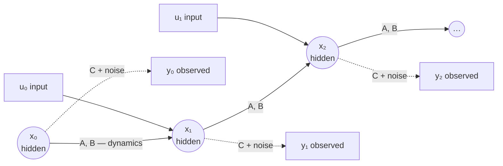

---
aliases:
  - State Space
  - State-Space Representation
  - State Space Model
  - State Vector
  - Hidden State
  - Latent State
  - Dynamics Model
  - Observation Model
  - Linear Dynamical System
  - LDS
tags:
  - control-theory
  - estimation
  - decision-sciences
  - fundamentals
---
> [!ABSTRACT] 🧠 Recall
> **In one line:** Describe a system with **two equations** — how its hidden **state** moves, and what you get to **observe** of it. The state is the *minimum you'd need to know so that the past stops mattering.*
> **Metaphor:** A puppet behind a screen. You never see the puppet, only its shadow — and the shadow is all your sensors ever give you.
> **Where it bites:** Every filter, every [[Markov Decision Process|MDP]], every RNN hidden state — and it's what the "SSM" in S4 / Mamba literally stands for.

---
A radar pings a car on a straight road: **100 m**.

Where will the car be in one second?

You can't say. It might be parked. It might be doing 70. A single position reading tells you where it *is* and nothing about where it's *going*.

So a second ping, one second later: **120 m**. *Now* you can answer — it's doing 20 m/s, so it'll be at 140.

Notice what you just did. You decided that "position" wasn't enough of a description, and that **position *and* velocity** was. ~={blue}What was the test you applied to decide that?=~

---
# The puppet and the shadow 🎭

The test was: *do I know enough that the history no longer adds anything?*

With position alone, the past still matters — you need the previous ping to work out the speed. With (position, velocity) in hand, you can throw every earlier ping away. Nothing in the past could improve your prediction. **That's what makes something a state.**

And there's a second, separate fact hiding in the story: the radar never reports velocity. It reports *position*, a bit noisily. The thing you need and the thing you get are **not the same object**.

![[state_vs_observation_shadows.png]]

So picture a puppet behind a lit screen. The puppet is the **state** — the full truth, moving by its own rules. The shadow on the screen is the **observation** — flatter, blurrier, and all you ever see. Your whole job is to work out what the puppet is doing from the shadow.

> [!NOTE] State
> The smallest set of variables such that, given them (and any future inputs), **the past is irrelevant** for predicting the future. That's the [[Markov Property]] — and it's a property you *design in* by choosing what to include, not one you discover. See [[Markov Property#^markov-is-about-state-design|state design]]. ^state-def

---
# The two equations

Say it in words first:

> **next state** = (how the state moves on its own) + (what my input does to it) + (things I can't predict)
> **what I observe** = (the part of the state my sensor sees) + (sensor noise)

And now the symbols:

$$x_{t+1} = A\,x_t + B\,u_t + w_t \qquad\qquad y_t = C\,x_t + v_t$$

For the car, with state $x = \begin{bmatrix}\text{position}\\ \text{velocity}\end{bmatrix}$, a 1-second step, and the accelerator as input:

$$A = \begin{bmatrix}1 & 1\\ 0 & 1\end{bmatrix} \quad B = \begin{bmatrix}0.5\\ 1\end{bmatrix} \quad C = \begin{bmatrix}1 & 0\end{bmatrix}$$

Read them: $A$ says *new position = old position + velocity; velocity carries over*. $B$ says *acceleration nudges both*. And $C = [1\ \ 0]$ is the radar — **it sees the first entry and is blind to the second.** Put in 100 m and 20 m/s: $A x = [120,\ 20]$. There's the 120.

| Symbol | Name | For the car |
|---|---|---|
| $x_t$ | **state** (hidden) | position and velocity |
| $u_t$ | input / action | accelerator |
| $y_t$ | **observation** | the radar's position reading |
| $A$, $B$ | **dynamics** | physics |
| $C$ | **observation model** | what the sensor can and can't see |
| $w_t$ | **process noise** | how wrong the *model* is (wind, bumps) |
| $v_t$ | **measurement noise** | how wrong the *sensor* is |

> [!SUCCESS] Core idea
> ~={pink}Separate what the world **is** from what you **observe**, and write one equation for each.=~ That was Kalman's move, and everything downstream — filtering, control, MDPs, POMDPs — is built on that split. A [[Transfer Function]] only relates input to output; a state-space model keeps the insides in view. ^two-equations

---
# The same skeleton, everywhere

| Field | "State" | "Dynamics" | "Observation" |
|---|---|---|---|
| Tracking | position, velocity | physics | radar, GPS → [[Kalman Filter]] |
| Discrete labels | hidden regime / weather | transition table | emissions → [[Hidden Markov Model]] |
| Decision-making | the MDP state | $P(s' \mid s, a)$ | full (MDP) or partial → [[POMDP]] |
| RNN / LSTM | the hidden vector $h_t$ | *learned* recurrence | the output head |
| S4 / Mamba | a learned linear state | *learned* $A, B$ | learned $C$ |

> [!TIP] "State space model" in a deep-learning paper means exactly this
> S4-style layers *are* the two equations above with $A$, $B$, $C$ learned by gradient descent. Knowing the control-theory original makes those papers much less mysterious. And an RNN is the nonlinear version: $h_{t+1} = f(h_t, u_t)$, $y_t = g(h_t)$.

> [!WARNING] The state is not "what the sensors report"
> This is the mix-up to avoid. The **state** is what you would *need to know*. The **observation** is what you *happen to get*. They coincide only when you're lucky. When some part of the state leaves no trace at all in the observations, no algorithm can recover it — that's [[Observability]]. And stacking four video frames so a network can see *velocity* ([[DQN]]) is nothing more than repairing a state that was missing a piece. ^state-is-not-observation

---
---
#### 🖼️ Two chains: the truth moves on top, the shadows drop below

---
> [!SUCCESS] If you remember one thing
> **State** = enough to forget the past. **Observation** = the shadow it casts. ~={pink}Most estimation problems are just "recover the puppet from the shadow", and most modelling mistakes are a state that's missing a piece.=~

---
# ⁉️
So there's a hidden state, a model of how it moves, and a noisy sensor that sees part of it. Two imperfect sources of information about the same thing. How do you combine them into one best guess?

→ [[Kalman Filter]]
