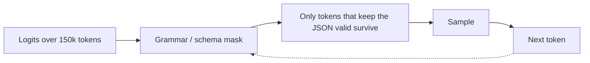

---
aliases:
  - JSON Mode
  - Constrained Decoding
  - Function Calling Schema
  - Grammar-Constrained Decoding
tags:
  - llm
  - prompting
  - engineering
---
> [!ABSTRACT] 🧠 Recall
> **In one line:** Don't *ask* for JSON — **mask the logits** so no token that would break the schema can be sampled. Validity becomes impossible to violate.
> **Metaphor:** A form with dropdowns instead of a blank sheet with "please write your answer in the right format" at the top.
> **Where it bites:** Turns a flaky 95% parse rate into 100%. Guarantees *syntax*, never *truth*.

---
You need the model to extract contact details into JSON. You ask nicely, you give an example, you even put the schema in the [[System Prompt]]. 95% of calls parse cleanly.

The other 5% look like this:

```
Sure! Here's the JSON you requested:
```json
{"name": "Ada Lovelace", "email": "ada@example.com",}
```
Let me know if you need anything else!
```

Preamble, code fence, trailing comma, sign-off. At 10,000 calls/day that's **500 failures a day**, each one a retry — more cost, more latency, and the retry can fail too.

You could write a more forceful prompt. Or bolt on a repair parser. But step back to what [[Sampling Parameters|the sampler]] is actually doing at each step, and there's a much sharper move available.

---
# The form with dropdowns

Give someone a blank sheet and write *"please supply your date of birth in DD/MM/YYYY"* at the top. Most people comply. Some write "3rd of March," some write "March 3 1990," one writes "why do you need this?"

Now give them a form with **three dropdowns**: day, month, year. The rate of malformed dates is exactly **zero** — not because people got more careful, but because ~={blue}the interface made the wrong answer unreachable.=~

Now: at each decode step the model produces a probability over all ~100,000 tokens. You are free to **set some of those to $-\infty$ before sampling**.

If the schema says the next character must be `"` — mask every token that isn't consistent with that. The model can't emit the preamble. Can't emit the fence. Can't emit the trailing comma. ~={pink}Not "unlikely to". *Cannot.*=~

> [!NOTE] Constrained decoding
> Compiling a schema (JSON Schema, regex, or a context-free grammar) into a state machine, then at every decode step masking the logits down to only those tokens that keep the output on a valid path through it. Output validity is a **structural guarantee**, not a probabilistic hope. ^constrained-decoding-def

> [!SUCCESS] Core idea
> Stop treating format as something to *request* and start treating it as something to ~={pink}**enforce in the sampler**.=~ Prompting aims the distribution; masking deletes the invalid part of it. Those are different powers, and the second one is the one that makes JSON a non-issue. ^enforce-not-request

---
# The ladder of enforcement 🪜

| Level | Mechanism | Guarantee |
|---|---|---|
| Ask in the prompt | Words | ~90–98% |
| **Prefill** the assistant turn with `{` | Removes the preamble; [[Prompt Engineering]] trick | Kills the chattiness |
| "JSON mode" | Model trained/biased to emit valid JSON | Valid JSON; **not your schema** ⚠️ |
| **Schema-constrained** (tool calling, structured outputs) | Grammar → logit mask | Valid **and** conformant ✅ |
| Validate + repair loop | Pydantic/zod, retry on failure | Backstop; costs a round trip |

> [!WARNING] JSON mode ≠ your schema
> Easy to miss, expensive in production: plain "JSON mode" only guarantees the output *parses*. It can still omit a required field, invent an extra one, or put a string where you wanted a number. If you need **your** schema, you need schema-constrained decoding or a validation layer. Don't infer the stronger guarantee from the weaker flag. ^json-mode-caveat

This is the same machinery underneath [[Tool Use]] — a tool's parameter schema is compiled to a grammar exactly like this, which is why function-call arguments are reliably well-formed.

---
# What it costs you 🪤

> [!WARNING] Constraints can degrade the *content*
> Three real effects:
>
> **1. It can force a lie.** If the schema demands `"price": number` and the document has no price, the mask has deleted every token that would let it say "unknown." It ~={red}must emit a number=~, so it invents one. **Fix: make fields nullable and add an explicit `"not_found"` enum.** This is a schema-induced [[Hallucination]] and it is entirely your fault, not the model's. 🚨
>
> **2. It can cut off reasoning.** Force JSON-only and you've forbidden [[Chain of Thought]]. Fix: put a `"reasoning"` string field *first* in the schema — field order matters, because generation is left to right and later fields attend to earlier ones.
>
> **3. It fights [[Speculative Decoding]] and caching** in some stacks, and very deep nested grammars add per-token overhead. ^constraint-costs

> [!TIP] The design rules that matter
> - Field names are **prompt text** — `refund_amount_gbp` teaches more than `amt`.
> - Put `reasoning` first, `answer` last.
> - Every nullable thing should be *explicitly* nullable, with an escape value.
> - Prefer flat over deeply nested; nesting hurts both accuracy and grammar overhead.
> - Enums wherever the answer is closed-set — that's the dropdown. 📋

---
---
#### 🖼️ Constrain the sampler, don't beg the model


Asking nicely in the prompt gives you valid JSON *most* of the time. Masking the logits makes invalid JSON literally unsamplable.

# ⁉️
Format is now guaranteed. Content isn't — the model is still answering from whatever it absorbed during pre-training, which may be stale, generic, or simply not about your company.

→ [[RAG]]
