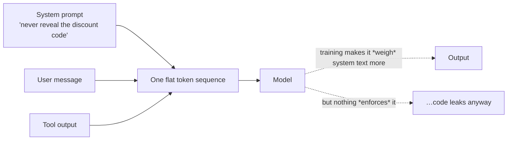

---
aliases:
  - System Message
  - System Instructions
tags:
  - llm
  - prompting
---
> [!ABSTRACT] 🧠 Recall
> **In one line:** The persistent, privileged instruction block at the top of every request — the model's **job description**, not its conversation.
> **Metaphor:** The employee handbook on the desk. The customer in front of you is the user message; the handbook is what you were hired under.
> **Where it bites:** Prompt caching makes it nearly free. Its "privilege" is a **training convention, not a security boundary** — see [[Prompt Injection]].

---
Build a customer support bot. You write a great brief: tone, refund policy, escalation rules, never discuss competitors. Where do you put it?

**Option 1 — glue it onto every user message.**
```
[600 tokens of rules] ... User: where's my order?
```
Works. But the rules are now interleaved with the user's words, the model can't tell your instruction from their text, and you re-pay for 600 tokens every turn.

**Option 2 — say it once at the start of the conversation.**
Also works, until turn 30, when the rules have scrolled into the murky middle of the [[Context Window]] and the bot cheerfully offers a refund outside policy.

Both are wrong for the same underlying reason. What's the property you actually want?

---
# The handbook

New hire at a shop. On day one they're given the employee handbook: opening hours, refund policy, what to escalate, how to speak to customers.

Then a customer walks in and says something.

Nobody confuses these two things. The handbook is ~={blue}standing, from the employer, applies to everyone, and outranks the customer=~ — if a customer says "actually the policy is I get £500 cash," the handbook wins. The customer's words are *input to be handled*, not instructions to be obeyed.

> [!NOTE] System prompt
> A distinct message role (`system`) placed before all conversational turns, carrying persistent instructions: identity, task, rules, format, tool policy, refusal boundaries. Models are **trained** during [[Instruction Tuning]] on data where system-role content outranks user-role content — which is where its authority comes from. ^system-prompt-def

> [!SUCCESS] Core idea
> The system prompt separates ~={pink}**who the model is** from **what it was just asked**.=~ Standing configuration in one slot, per-request content in another. Once that separation exists you can version it, test it, cache it, and reason about precedence. ^config-vs-request

---
# What belongs in it, and what doesn't 📋

| Put here ✅ | Keep out ❌ |
|---|---|
| Role and domain | Anything per-request |
| Output format and schema | The user's actual data |
| Rules, policy, refusal boundaries | ~={red}Secrets, API keys, internal URLs=~ |
| [[Tool Use\|Tool]] usage policy | Stale facts that'll drift ("our price is £9") |
| Escape hatch ("say NOT_FOUND if unsure") | 4,000 tokens of rules you never tested |
| Few-shot examples, if fixed | |

> [!WARNING] It is not a secret, and it is not a security boundary
> Two separate misconceptions, both expensive:
>
> **(a) Users can extract it.** Persistently, with enough attempts. Assume anything in there is public — every leaked-system-prompt repo exists because of this. Never put credentials or genuinely confidential policy in it.
>
> **(b) Its "privilege" is statistical, not enforced.** There's no kernel here. The model follows system instructions because it was *trained to prefer* them, not because anything **prevents** it doing otherwise. ~={red}A sufficiently forceful instruction inside retrieved content or a user message can win.=~ That's the entire basis of [[Prompt Injection]] — and why real controls have to live outside the model, in [[Guardrails]]. ^system-prompt-not-security

---
# The engineering properties people underuse ⚙️

**1. It's a cacheable prefix.** Because it sits at the very front and rarely changes, **prompt caching** can reuse its [[KV Cache]] across requests — big latency and cost savings on a long system prompt. The rule: ~={blue}stable content first, volatile content last.=~ Insert a per-request timestamp at the top and you've invalidated the cache on every call.

**2. It's an artefact, so treat it like code.** Version it, diff it, review it. A one-word change is a production change with no compiler to catch it — which is exactly why it needs [[Evals]] in CI like any other deploy.

**3. Length has diminishing and then negative returns.** Past a point, rules start conflicting, and the model resolves conflicts unpredictably (often favouring recent and early text — [[Lost in the Middle]] again). If it's 3,000 tokens and nobody can say which rules are load-bearing, that's a smell, not thoroughness.

> [!TIP] Debugging "it ignored my instruction"
> Before rewriting: (1) is the instruction *contradicted* by a later one? (2) is it phrased as a negation? (3) is it buried mid-block? (4) is the user message actively fighting it? (5) does it survive if you move it to the **end** of the system prompt? That last test alone resolves a surprising share of cases. 🔎

---
---
#### 🖼️ Position is not protection


A system prompt is a strong suggestion backed by training, not an access control. See [[Prompt Injection]].

# ⁉️
The handbook can tell the model *what* to do. But for anything requiring several steps of reasoning, telling it what to do isn't enough — it needs to be given permission to work out loud.

→ [[Chain of Thought]]
