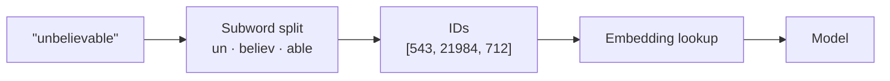

---
aliases:
  - Tokenizer
  - Tokens
  - BPE
  - Byte Pair Encoding
tags:
  - llm
  - inference
  - fundamentals
---
> [!ABSTRACT] 🧠 Recall
> **In one line:** The model never sees text — it sees **integers**, chopped by a fixed vocabulary that was frozen before training and can't be changed after.
> **Metaphor:** A typesetter's tray of lead blocks. Common words get their own block; anything unfamiliar has to be spelled out letter by letter.
> **Where it bites:** Your bill, your context budget, and every "why can't it count the r's in strawberry?" bug.

---
Type this into a model and watch the price:

```
"The quick brown fox"        →  4 tokens
"Antidisestablishmentarianism" →  7 tokens
"    " (four spaces)           →  1 token
"ও" (one Bengali letter)      →  3 tokens
```

Four English words cost four units. One long English word costs seven. A single Bengali character costs three.

Sit with that for a second — ~={blue}why would one character cost more than one word?=~

---
# The typesetter's tray

Picture an old print shop. The typesetter has a tray of lead blocks. He sets the page by pulling blocks out and lining them up.

He *could* keep one block per letter — 26 blocks, and he can print anything. But then "the" takes three pulls, and "the" shows up on every line of every page. Slow.

So he cheats. He casts a single block for `the`. And one for `ing`. And `tion`. Whatever he sees constantly, he casts as one block.

Now: how does he decide what gets its own block? He can't cast a block for every word — the tray would be infinite, and he'd still get caught out by a name he's never seen.

The rule he lands on is embarrassingly simple: **start with single letters, then repeatedly find the most common adjacent pair in the corpus and merge it into one new block.** Do that 50,000 times. Stop.

That's **Byte Pair Encoding**. That's the whole algorithm. ^bpe-def

> [!NOTE] Tokenization
> Turning a string into a sequence of integer IDs drawn from a **fixed, finite vocabulary** (typically 32k–200k entries) that was learned by merging frequent character pairs over a training corpus. The model's input layer is a lookup table with one row per vocabulary entry. ^tokenization-def

Now the Bengali answer falls out on its own: the corpus was mostly English, so `the` earned a block and `ও` never did — it gets spelled out in raw UTF-8 bytes, three of them. ~={blue}Token cost is a fossil record of what the training corpus contained.=~

---
# Why not just use characters? Or just use words?

This is the trade-off the merge count is tuning, and it's worth having both ends in your head:

| Unit | Vocab size | Sequence length | The problem |
|---|---|---|---|
| **Characters** | ~100 | Very long 😖 | Attention is $O(n^2)$ — see [[Query, Key, and Value (QKV)]]. A 1,000-word doc becomes 5,000 steps. Compute explodes. |
| **Words** | ~1,000,000 | Short | Vocabulary is unbounded. `Kubernetes`, `skrisshnaswamy`, typos → all become `<UNK>`. Information destroyed at the door. |
| **Subwords (BPE)** | ~50,000–200k | Middling ✅ | Nothing. This is why everyone uses it. |

> [!SUCCESS] Core idea
> Subword tokenization buys you a **closed vocabulary with no `<UNK>`**. Every possible string is representable, because worst case you fall back to bytes — while the strings you actually see often are still one token each. ~={pink}Finite table, infinite coverage.=~ ^subword-tradeoff

---
# The consequences you'll actually hit 🪤

**1. "How many r's in strawberry?"**
It fails not because it can't count, but because it ~={red}cannot see letters at all=~. `strawberry` arrives as maybe `str|aw|berry` — three opaque IDs. Asking it to count `r` is like asking you to count the serifs in a word you heard spoken aloud. Same reason it's bad at reversing strings and at rhyming in some languages.

**2. Your non-English users pay 2–4× more.**
Same sentence, more tokens. More money, and less of it fits in the [[Context Window]]. That's a real product-fairness issue, not a trivia fact.

**3. Trailing whitespace breaks few-shot prompts.**
` Paris` and `Paris` are *different token IDs*. If your prompt ends with a trailing space, you've already committed the model to the space-less variant, and the distribution over what comes next shifts. Classic silent [[In Context Learning|few-shot]] bug.

**4. Numbers are a lottery.**
`1234` might be `12|34` while `1235` is `123|5`. Arithmetic over inconsistently-chunked digits is genuinely hard. Newer tokenizers force digits to split individually for exactly this reason.

> [!TIP] Rules of thumb for capacity planning
> English: **~4 characters ≈ 1 token**, or **~0.75 words per token**. Code is denser (indentation and punctuation eat tokens). Always *measure* with the actual tokenizer before you size a context budget — see [[Context Window]]. 📏

---
# One more thing: the vocabulary is frozen

The tokenizer is chosen **before** pre-training and cannot change afterwards without invalidating every weight in the embedding table. You can't "add a token" to a shipped model and expect it to mean anything — the new row is random.

That's why domain jargon is expensive forever, and why [[Fine-Tuning]] on medical or legal text improves *behaviour* but never improves *token efficiency*.

---
---
#### 🖼️ From text to numbers, and where it goes wrong


Common words get one token. Rare words get shattered into pieces — which is why odd spellings, other languages and long numbers cost more and behave worse.

# ⁉️
So text becomes a list of integers. But there's a hard ceiling on how long that list can be — and everything about serving an LLM is downstream of that ceiling.

→ [[Context Window]]
