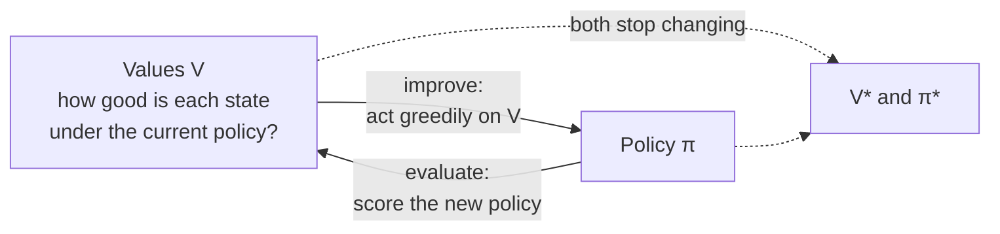

---
aliases:
  - Value Iteration
  - Policy Iteration
  - Policy Evaluation
  - Policy Improvement
  - Generalized Policy Iteration
  - Generalised Policy Iteration
  - GPI
  - Asynchronous Dynamic Programming
tags:
  - planning
  - reinforcement-learning
  - decision-sciences
---
> [!ABSTRACT] 🧠 Recall
> **In one line:** The two classic ways to **solve an MDP when you know its rules** — sweep the Bellman backup until values stop changing (*value iteration*), or alternate between *scoring* a policy and *improving* it (*policy iteration*).
> **Metaphor:** Ripples. Drop a stone at the goal and its value spreads outward, one ring per sweep.
> **Where it bites:** The evaluate ⇄ improve dance (**GPI**) is the skeleton of almost every RL algorithm, model or no model.

---
A 6×6 grid. A **goal** in the top-right corner worth +10. A **pit** worth −10. A wall. You know all the rules — moves are deterministic, $\gamma = 0.9$.

You want a number in every cell saying how good it is to stand there. You start with the only honest guess available: **zero, everywhere.**

The [[Bellman Equation]] says *value of here = reward for one step + $\gamma$ × value of where I land.* So apply it to every cell, once.

~={blue}After that single sweep, which cells have stopped being zero?=~

---
# Ripples 🌊

Only the ones **next to the goal** (and next to the pit). Everyone else looked at their neighbours, saw zeros, and stayed zero.

Sweep again, and the cells *two* steps away wake up — their neighbour now has a number. Again, and it's three steps.

![[value_iteration_ripples.png]]
> [!TIP] Reading the chart
> Information travels **one cell per sweep**, outward from wherever reward enters the world. That's why the number of sweeps you need grows with the size of the problem. In the last panel the arrows appear for free: each points at its best neighbour.

> [!NOTE] Value iteration
> Start with arbitrary values. Repeatedly apply the Bellman **optimality** backup to every state — $V(s) \leftarrow \max_a [R + \gamma \sum P\,V(s')]$ — until the largest change is negligible. Read the policy off at the end with an $\arg\max$. ^value-iteration-def

---
# The other route — policy iteration

Value iteration fuses two jobs into one line. Pull them apart:

1. **Evaluate.** Take your *current* policy, however bad, and work out its values properly — "if I keep behaving like this, how good is each state?" (The Bellman *expectation* equation; no max.)
2. **Improve.** In every state, look one step ahead using those values and switch to whichever action is best.
3. Repeat until the policy stops changing.

Each improvement is guaranteed to be at least as good, and there are only finitely many policies — so it must terminate, usually in a startlingly small number of rounds.

| | **Value iteration** | **Policy iteration** |
|---|---|---|
| One round | one cheap sweep | a full evaluation (many sweeps, or a linear solve) + one improvement |
| Rounds needed | many | **few** — often under ten |
| Stops when | values stop moving | the **policy** stops changing |
| Prefer when | large state spaces | few actions; evaluation is cheap |

---
# The idea that outlives both — GPI

Here's the part to carry forward. You don't have to finish evaluating before you improve. Value iteration is just policy iteration with evaluation cut to **one sweep**. You can do three sweeps. Or update one state at a time, in any order. It all still converges.

> [!SUCCESS] Core idea
> **Generalised Policy Iteration**: two processes chasing each other. *Evaluation* drags the values toward the truth **for the current policy**. *Improvement* makes the policy greedy **with respect to the current values** — which promptly makes those values out of date. ~={pink}They only stop fighting when both are optimal.=~ ^gpi

And once you see it, it's everywhere:

| Algorithm | The "evaluate" half | The "improve" half |
|---|---|---|
| [[Q-Learning]] | TD updates to $Q$ | the $\max$ in the target |
| [[On-Policy vs Off-Policy\|SARSA]] | TD updates to $Q$ | acting $\varepsilon$-greedily on it |
| [[Actor-Critic]] | the **critic** learns $V$ | the **actor** follows the advantage |
| [[Monte Carlo Tree Search\|AlphaZero]] | the value net, trained on game results | tree search produces a better policy → the net imitates it |
| [[RLHF]] with [[PPO]] | the value model | the clipped policy update |

The vault even has a paper arguing that self-improving agents fit the same frame: [[Generalized Agent Iteration- One Formal Framework for Iterative Policy Improvement and Recursive Self-Improvement]].

---
# What it needs

> [!WARNING] Two big asks — the same two as ever
> 1. **The model.** You need $P$ and $R$ to do a backup at all. No model → you must *sample* the backup from experience instead → [[Temporal Difference Learning]].
> 2. **A table you can sweep.** Every state, every round. 36 cells is nothing; [[Curse of Dimensionality|$10^{47}$ chess positions]] is not happening → [[Function Approximation]]. ^dp-asks

> [!TIP] Two practical speed-ups
> **Asynchronous DP** — don't sweep in a fixed order; update states in whatever order you like, in place. **Prioritised sweeping** — update the states whose values are *about to change the most* (the ones just behind the ripple's edge). Same answer, far fewer updates. The same instinct reappears as [[Experience Replay|prioritised replay]].

> [!WARNING] "You must evaluate fully before improving"
> You don't, and nobody does. The whole practical power of GPI is that **half-finished evaluation is enough** to improve on. That's what makes online learning possible — an agent improves its policy from value estimates that are *always* a bit wrong.

---
---
#### 🖼️ Two processes chasing each other

---
> [!SUCCESS] If you remember one thing
> **Evaluate the policy. Improve the policy. Repeat** — and you don't have to finish one before starting the other. ~={pink}Nearly every RL algorithm is that loop with one half or the other approximated.=~

---
# ⁉️
Look at the ripples again. The goal's value took many sweeps to reach the far corner. In a real task that's the core difficulty: a reward *here* has to somehow inform a decision made *a long time ago*. How does the credit get all the way back?

→ [[Credit Assignment]]
