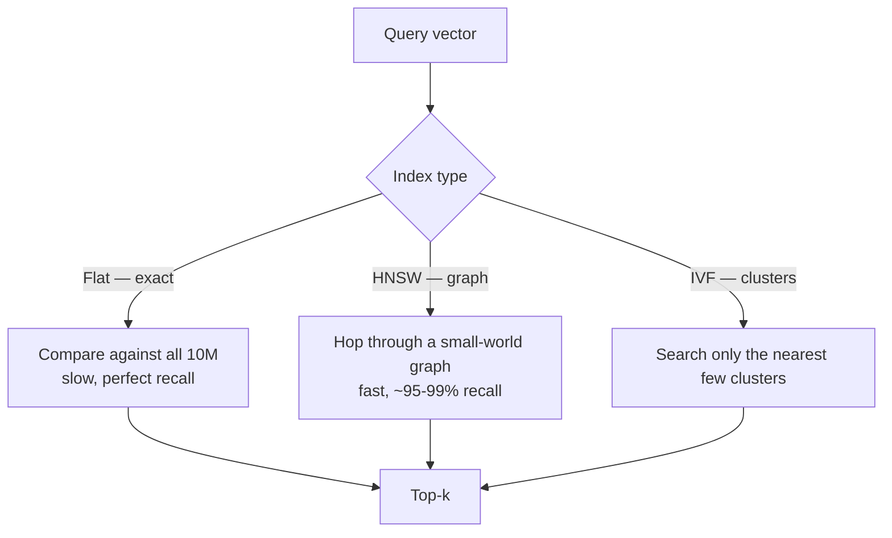

---
aliases:
  - Vector Store
  - ANN Search
  - Approximate Nearest Neighbour
  - HNSW
  - Vector Index
tags:
  - llm
  - retrieval
  - infrastructure
---
> [!ABSTRACT] 🧠 Recall
> **In one line:** An index that finds *approximately* the nearest vectors in **log-ish** time — trading a slice of recall for a 1000× speedup.
> **Metaphor:** A city's road network. You don't check every address; you take the motorway to the right district, then local roads.
> **Where it bites:** `recall@k` is a **dial you chose**, not a property of the system. Most people never look at it.

---
50 million chunks, each a 768-dimensional [[Embeddings|embedding]]. A query arrives.

Brute force: 50M dot products of 768 dimensions = ~38 billion multiply-adds, per query. Even fully vectorised that's hundreds of milliseconds and enormous memory bandwidth. At 100 queries/sec it's hopeless.

The instinct from normal databases is "add an index." But think about what a **B-tree** does: it sorts on a key, so it can binary-search. What's the sort order of a 768-dimensional point? There isn't one. Sort by dimension 1 and two vectors adjacent in that dimension can be maximally far apart in the other 767.

Every classical spatial structure (k-d trees, R-trees) dies the same way above ~20 dimensions — the **curse of dimensionality** means almost all points end up roughly equidistant from each other. So exact indexing is out.

Which means you have to give something up. ~={blue}What's the cheapest thing to give up?=~

---
# The road network

You're in Manchester, you want the nearest good curry house. Do you compute the distance to all 50 million buildings in Britain?

No. You get on the **motorway** — a small number of long-range links that move you across the country fast. You come off near the right city, take A-roads into the right district, then walk street by street, always to whichever neighbour is closer to where you're heading. You stop when no neighbour is closer.

You might not find the *mathematically* closest curry house. You'll find one of the closest ones, in seconds instead of a week.

That's **HNSW**, essentially exactly. Build a graph where each vector links to its neighbours, and stack it in layers: the top layer is sparse with very long edges (motorways), each layer below is denser with shorter edges (A-roads, then streets). Search top-down, greedily.

> [!NOTE] ANN search
> **Approximate Nearest Neighbour** search: return vectors that are *probably* among the true top-$k$, measured by **recall@k** (what fraction of the true top-$k$ you actually returned). You give up exactness — nothing else. ^ann-def

> [!SUCCESS] Core idea
> ~={pink}Exactness was the least valuable thing you had.=~ If the 9th-best chunk sneaks in instead of the 10th, your [[RAG]] answer is unchanged — a [[Reranking|reranker]] will re-sort them anyway. Trading 2% recall for a 1000× speedup is one of the best deals in systems engineering. ^recall-is-cheap

→ [[Efficient and robust approximate nearest neighbor search using HNSW]]

---
# The three index families 🗂️

| Index | How | Speed | Recall | Memory | Use when |
|---|---|---|---|---|---|
| **Flat (brute force)** | Compare everything | Slow | **100%** | Vectors only | < ~1M vectors. Genuinely fine, and the honest baseline |
| **IVF** | Cluster into cells; search the nearest few (`nprobe`) | Fast | Tunable | Low | Large, batch-ish, memory-tight |
| **HNSW** | Layered proximity graph | **Fastest** ✅ | High | ~={red}Heavy (graph + vectors)=~ | Low-latency online search — the default |
| **+ PQ** | Compress vectors to codes ([[Product Quantization for Nearest Neighbor Search (IEEE TPAMI)]]) | Fast | Lower | **Tiny** | Billion-scale on one box |

The knobs (`efSearch` for HNSW, `nprobe` for IVF) are pure **recall-vs-latency dials**. Turn them up, get better recall and slower queries. There is no correct setting — only the one your product can afford.

---
# The bit that decides your architecture 🏗️

> [!WARNING] Pure vector search is half a retrieval system
> Vectors are blind to exact tokens: part numbers, error codes, surnames, version strings. BM25 keyword search nails those and is blind to paraphrase. ~={red}Every serious retrieval system runs both and fuses the results=~ (Reciprocal Rank Fusion is the standard, boringly effective merge).
>
> And **metadata filtering is not a bolt-on.** "Only documents this user may read, from 2024, in the EU region" must be applied *during* the graph traversal (pre-filtering), or you retrieve 50 and discover 3 are permitted. Post-filtering silently destroys recall — and if permissions are the filter, it's also a ~={red}security hole=~. Check how your store does it; they differ enormously. ^hybrid-and-filtering

> [!TIP] Do you even need a vector database?
> Hierarchy of honest answers:
> - **< 100k chunks** → numpy, or `pgvector` in the Postgres you already run. Seriously.
> - **< 10M, already on Postgres** → `pgvector` with HNSW. One system to operate, transactions, joins, and your permissions model for free.
> - **> 10M, or you need filtered search at scale / multi-tenancy** → a dedicated store (Qdrant, Milvus, Weaviate, Vespa, Turbopilot-likes).
>
> "We need a vector DB" is very often ~={blue}"we need 40 lines of numpy"=~ wearing a procurement badge. 🧮

See [[ML Infrastructure]] for where this sits, and note the lineage: this is the same ANN machinery that's powered [[Recommender Systems - Evolution|candidate generation in recsys]] for years.

---
---
#### 🖼️ Why you give up exactness on purpose

# ⁉️
ANN hands you 50 candidates ranked by a similarity that we already established isn't relevance. Something has to actually **read** them and decide.

→ [[Reranking]]
